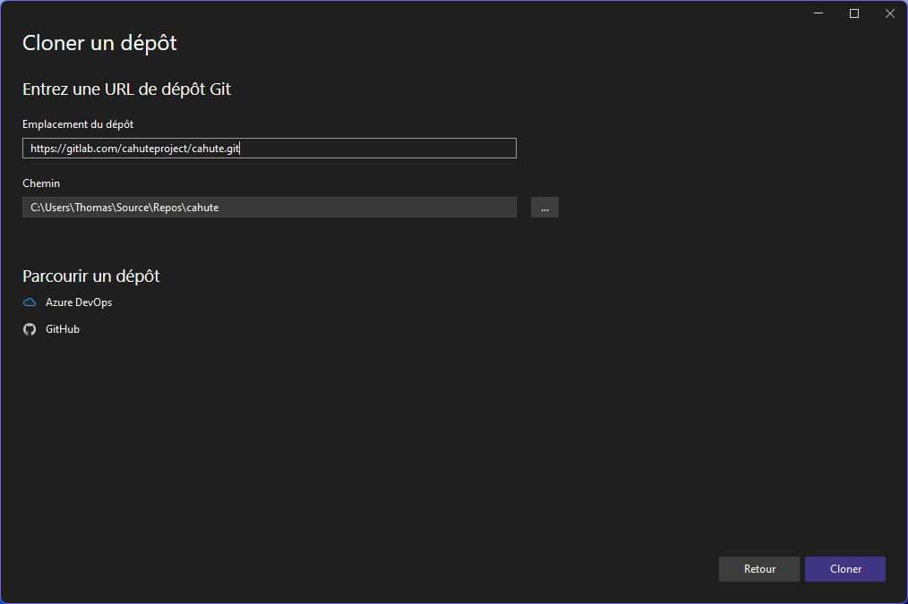
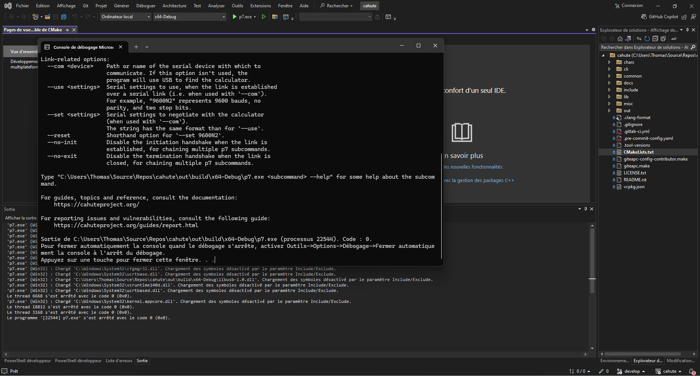
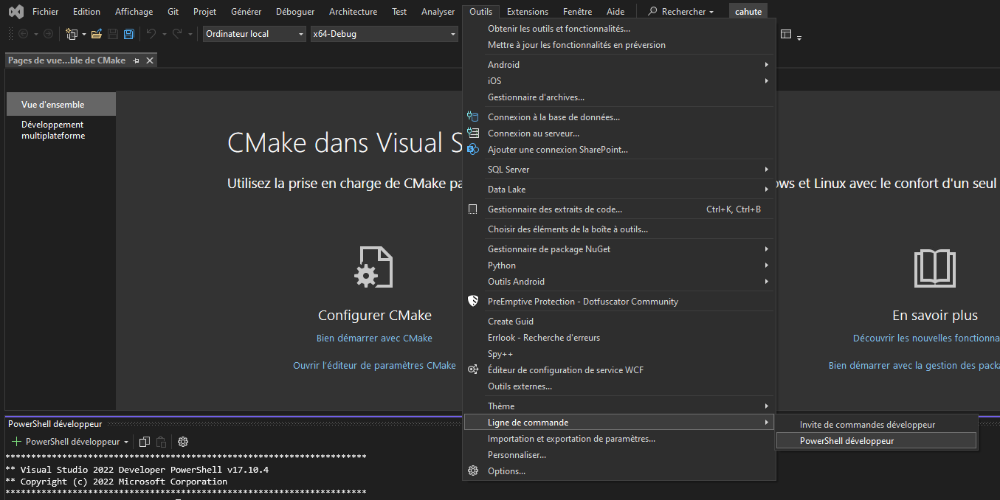
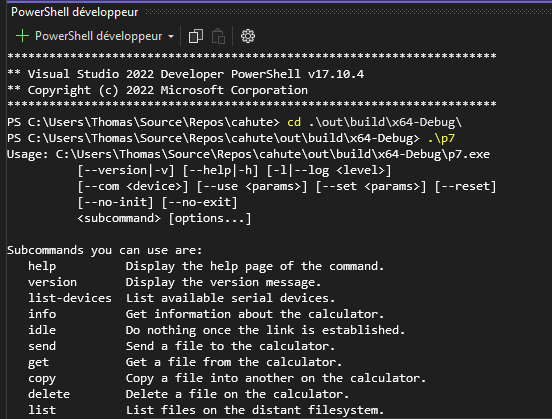

.. _build-windows:

|win| Building Cahute for Windows
=================================

.. warning::

    In order to install Cahute on Windows, it is recommended to use one of
    the methods in :ref:`install-windows`. However, if you wish to build Cahute
    manually, this guide is for you.

The following building methods are available.

.. note::

    Since you will not be using a packaged version of Cahute, the project won't
    be automatically updated when updating the rest of the system, which
    means you will need to do it manually, especially if a security update is
    made.

    You can subscribe to releases by creating a Gitlab.com account, and
    following the steps in `Get notified when a release is created`_.
    You can check your notification settings at any time in Notifications_.

.. _build-windows-vs:

Building Cahute for Windows XP and above, using Visual Studio
-------------------------------------------------------------

.. warning::

    Both Windows XP and above as a target and this build method are not
    officially supported yet.

    See `#10 <https://gitlab.com/cahuteproject/cahute/-/issues/10>`_ for
    more information.

It is possible to build Cahute for Windows XP and above, using Microsoft's
`Visual Studio`_ starting from version 17.6 (VS2022).

.. warning::

    Visual Studio is **not to be confused** with `Visual Studio Code`_, which
    is an entirely different program.

.. note::

    This version of Visual Studio is targeted since it is the first to
    include ``vcpkg`` (`source <vcpkg is Now Included with Visual Studio_>`_).
    It may be possible to compile Cahute on earlier versions of Visual
    Studio; see `Install and use packages with CMake`_ for more information.

Cloning the Cahute repository
~~~~~~~~~~~~~~~~~~~~~~~~~~~~~

When opening Visual Studio, select "Clone a repository" (first option).

.. figure:: msvs1.png

    Initial window for Visual Studio, with the first option selected.

Enter the URL of the repository you're cloning
(``https://gitlab.com/cahuteproject/cahute.git`` if cloning the upstream),
and select "Clone".

    Repository cloning window, with the information filled out to clone
    the main branch on the official project repository.

.. note::

    The IDE may open to nothing much, such as in this example:

    .. figure:: msvs3.png

        Empty IDE windows, obtained after cloning the repository.

    In this case, double-clicking on "Directory view" in the Solution Explorer
    on the right should solve this.

Once the repository is loaded, the IDE should automatically prepare the
repository for building using CMake and vcpkg. The resulting view should
resemble this:

.. figure:: msvs4.png

    Visual Studio, after the repository was successfully loaded and configured.

.. warning::

    You may have the following error when configuring the project using CMake::

        Could NOT find PkgConfig (missing: PKG_CONFIG_EXECUTABLE)

    This is likely, in fact, an error with the vcpkg integration with Visual
    Studio, as by default, packages are not installed and accessed.
    In order to do this, as described in `Installing and using packages
    (vcpkg)`_, you can either:

    * Integrate ``vcpkg`` for all projects with Visual Studio, by running
      ``vcpkg integrate install``;
    * Only enable ``vcpkg`` by setting ``CMAKE_TOOLCHAIN_FILE`` manually in
      the ``CMakeSettings.json`` to your vcpkg install's ``vcpkg.cmake``.

Building the project
~~~~~~~~~~~~~~~~~~~~

From here, you can select the target you want to build next to the green arrow
on the top, and the architecture you're targetting. By leaving the default
(``x64-Debug``) and clicking on ``p7.exe``, we obtain the following:

    Visual Studio, after building and running p7.

Since Cahute defines mostly command-line utilities, it may be more interesting
to have access to a command-line interface. In order to this, in the context
menu, select "Tools", "Command line", then "Developer Powershell":

    Visual Studio, with contextual menus opened up to "Developer Powershell".

A console should open at the bottom of the IDE. In this console, use ``cd``
to go to the build directory (by default, ``.\out\build\<target>``), and
run the command-line utilities from here with the options you want to test.

    A PowerShell developer console opened in Visual Studio, running p7 from
    the build directory directly.

.. _build-windows-mingw:

Building Cahute for Windows XP and above, using |mingw-w64| MinGW-w64 on Archlinux
----------------------------------------------------------------------------------

.. warning::

    Both Windows XP and above as a target and this build method are not
    officially supported yet.

    See `#10 <https://gitlab.com/cahuteproject/cahute/-/issues/10>`_ for
    more information.

Building Cahute for Windows XP and above from Archlinux_
using `MinGW-w64`_ is possible, as described in `Cross Compiling With CMake`_.

Downloading the Cahute source
~~~~~~~~~~~~~~~~~~~~~~~~~~~~~

.. include:: _download_source.rst

Installing the dependencies
~~~~~~~~~~~~~~~~~~~~~~~~~~~

You need to first install the required dependencies from the AUR, by using
your favourite AUR helper, e.g. with paru_::

    paru -S cmake python python-toml mingw-w64 \
        mingw-w64-cmake mingw-w64-libusb mingw-w64-sdl2

Building the project
~~~~~~~~~~~~~~~~~~~~

In the parent directory to the source, you can now create the ``build``
directory aside it, by running either one of the following command depending
on the architecture you're targeting:

.. parsed-literal::

    i686-w64-mingw32-cmake -B build -S cahute-|version|
    x86_64-w64-mingw32-cmake -B build -S cahute-|version|

You can now build the project using the following command::

    cmake --build build

Before testing with either Wine or a Windows host, it is recommended to
copy the required shared libraries to the build directory, by running either
one of the following command depending on the architecture you're targetting::

    cp /usr/i686-w64-mingw32/bin/{libssp-0,SDL2,libusb-1.0}.dll .
    cp /usr/x86_64-w64-mingw32/bin/{libssp-0,SDL2,libusb-1.0}.dll .

.. warning::

    In order for Cahute to be usable on Windows XP, you need to use a previous
    release of libusb as system requirements have been upgraded.

    `libusb 1.0.23`_ has been proven to work in such cases. The DLLs can be
    found in the ``libusb-1.0.23.7z`` archive, more specifically in the
    ``MinGW32/dll`` and ``MinGW64/dll`` directories.

.. note::

    For reference, this build method is used in the
    `MinGW build image for Cahute`_, which is exploited in the project's
    continuous integration pipelines as described in ``.gitlab-ci.yml``.

.. |win| image:: ../install-guides/win.png
.. |mingw-w64| image:: mingw-w64.svg

.. _Get notified when a release is created:
    https://docs.gitlab.com/ee/user/project/releases/
    #get-notified-when-a-release-is-created
.. _Notifications: https://gitlab.com/-/profile/notifications

.. _cmake: https://cmake.org/
.. _Python: https://www.python.org/
.. _python-toml: https://pypi.org/project/toml/
.. _GNU Make: https://www.gnu.org/software/make/
.. _pkg-config: https://git.sr.ht/~kaniini/pkgconf
.. _SDL: https://www.libsdl.org/
.. _libusb: https://libusb.info/

.. _MinGW-w64: https://www.mingw-w64.org/
.. _Archlinux: https://archlinux.org/
.. _paru: https://github.com/Morganamilo/paru
.. _libusb 1.0.23: https://github.com/libusb/libusb/releases/tag/v1.0.23
.. _Cross Compiling With CMake:
    https://cmake.org/cmake/help/book/mastering-cmake/chapter/
    Cross%20Compiling%20With%20CMake.html?highlight=mingw
.. _MinGW build image for Cahute:
    https://gitlab.com/cahuteproject/docker-images/-/blob/develop/mingw-w64/
    archlinux.Dockerfile?ref_type=heads

.. _Visual Studio: https://visualstudio.microsoft.com/fr/
.. _Visual Studio Code: https://visualstudio.microsoft.com/fr/
.. _vcpkg is Now Included with Visual Studio:
    https://devblogs.microsoft.com/cppblog/
    vcpkg-is-now-included-with-visual-studio/
.. _Install and use packages with CMake:
    https://learn.microsoft.com/en-us/vcpkg/get_started/get-started
.. _Installing and using packages (vcpkg):
    https://github.com/microsoft/vcpkg-docs/blob/main/vcpkg/examples/
    installing-and-using-packages.md#-step-2-use
