.. _build-guide-windows:

|win| Building Cahute for Microsoft Windows
===========================================

.. warning::

    In order to install Cahute on Windows, it is recommended to use one of
    the methods in :ref:`install-guide-windows`. However, if you wish to
    build Cahute manually, this guide is for you.

The following building methods are available.

.. note::

    Since you will not be using a packaged version of Cahute, the project won't
    be automatically updated when updating the rest of the system, which
    means you will need to do it manually, especially if a security update is
    made.

    You can subscribe to releases by creating a Gitlab.com account, and
    following the steps in `Get notified when a release is created`_.
    You can check your notification settings at any time in Notifications_.

.. _build-guide-windows-vs:

Building Cahute for Microsoft Windows Vista and above, using Visual Studio
--------------------------------------------------------------------------

.. warning::

    Both Windows XP and above as a target and this build method are not
    officially supported yet.

    See :ref:`feature-topic-system-windows` for more information.

It is possible to build Cahute for Windows Vista and above, using Microsoft's
`Visual Studio`_.

Setting up the project and configuration
~~~~~~~~~~~~~~~~~~~~~~~~~~~~~~~~~~~~~~~~

If you have not set up the project, **you must follow the instructions in**
:ref:`misc-guide-vs-clone`.

Once this is done, you need to go to the project's CMake configurations, by
going in "Project", then "CMake settings for cahute":

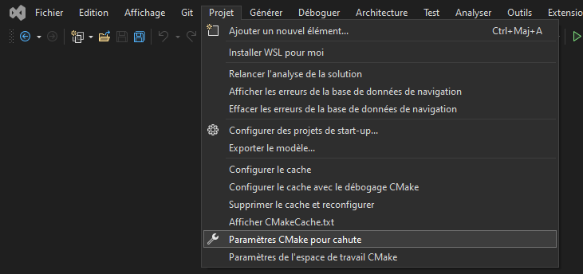

    Visual Studio, with the "CMake settings" menu selected.

Look for "x64-Windows" in the configuration list. If you do not have such a
configuration yet, click on the "+" icon:

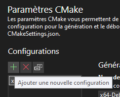

    Configuration list, with the "+" button highlighted.

This will open a list of configurations to add. Look for "x64-Release", then
click on "Select" at the bottom of the window:

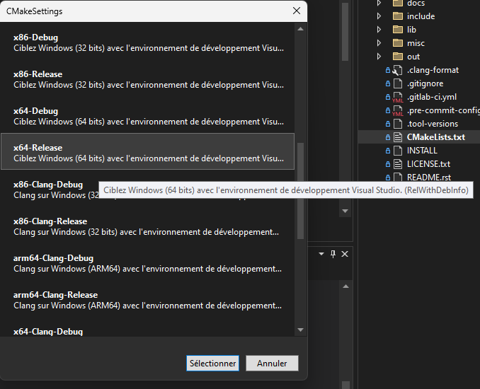

    Sample configuration list, with the "x64-Release" configuration
    highlighted.

Once this is selected, the new configuration should appear in your list.
Select it, then click on the configuration type to update its value
to "Release":

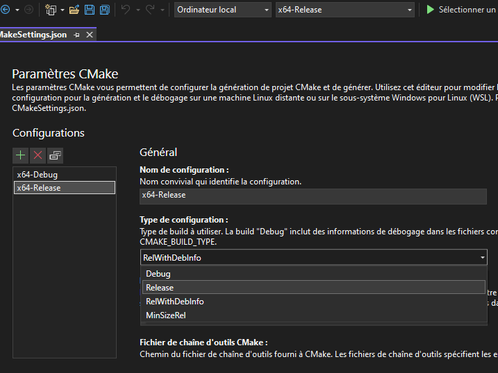

    Configuration details for "x64-Release", with the configuration type
    dropdown selected and the "Release" option highlighted.

Once this is selected, you can save by clicking on the floppy on the top left
of the IDE, or using the Ctrl+S shortcut.

.. warning::

    You may have the following error when configuring the project using CMake::

        Could NOT find PkgConfig (missing: PKG_CONFIG_EXECUTABLE)

    This is likely, in fact, an error with the vcpkg integration with Visual
    Studio, as by default, packages are not installed and accessed.
    In order to do this, as described in `Installing and using packages
    (vcpkg)`_, you can either:

    * Integrate ``vcpkg`` for all projects with Visual Studio, by running
      ``vcpkg integrate install``;
    * Only enable ``vcpkg`` by setting the CMake toolchain option to
      your vcpkg install's ``vcpkg.cmake``:

    .. figure:: winvsa5.png

        Configuration details for "x64-Release", with selection of the CMake
        toolchain to use vcpkg's ``vcpkg.cmake``.

Building the project
~~~~~~~~~~~~~~~~~~~~

From here, you can select the target you want to build next to the green arrow
on the top, and the architecture you're targetting. By leaving the default
(``x64-Debug``) and clicking on ``p7.exe``, we obtain the following:

.. figure:: winvsb1.png

    Visual Studio, after building and running p7.

Since Cahute defines mostly command-line utilities, it may be more interesting
to have access to a command-line interface. In order to this, in the context
menu, select "Tools", "Command line", then "Developer Powershell":

.. figure:: winvsb2.png

    Visual Studio, with contextual menus opened up to "Developer Powershell".

A console should open at the bottom of the IDE. In this console, use ``cd``
to go to the build directory (by default, ``.\out\build\<target>``), and
run the command-line utilities from here with the options you want to test.

.. figure:: winvsb3.png

    A PowerShell developer console opened in Visual Studio, running p7 from
    the build directory directly.

.. _build-guide-windows-vs-xp:

Building Cahute for Microsoft Windows XP, using Visual Studio
-------------------------------------------------------------

.. warning::

    Both Windows XP and above as a target and this build method are not
    officially supported yet.

    See :ref:`feature-topic-system-windows` for more information.

It is possible to build Cahute for Windows XP, using Microsoft's
`Visual Studio`_.

Installing the MSVC v141_xp toolset for Visual Studio
~~~~~~~~~~~~~~~~~~~~~~~~~~~~~~~~~~~~~~~~~~~~~~~~~~~~~

By default, Visual Studio Installer selects MSVC v143 or later, which does not
support Windows XP. In order to support Windows XP, you will need to open
Visual Studio Installer, modify your existing installation, go to
"Individual components", then select everything pertaining to MSVC v141:

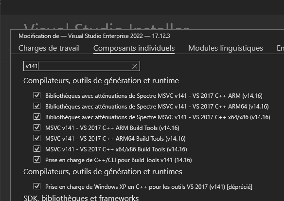

    Visual Studio Installer's "Individual components" tab, with MSVC v141
    elements selected.

You can then select "Modify" at the bottom right of the window in order to
download and configure MSVC v141.

Setting up the project and configuration
~~~~~~~~~~~~~~~~~~~~~~~~~~~~~~~~~~~~~~~~

If you have not set up the project, **you must follow the instructions in**
:ref:`misc-guide-vs-clone`.

Once this is done, you need to go to the project's CMake configurations, by
going in "Project", then "CMake settings for cahute":

    Visual Studio, with the "CMake settings" menu selected.

Look for "x64-Windows" in the configuration list. If you do not have such a
configuration yet, click on the "+" icon:

    Configuration list, with the "+" button highlighted.

This will open a list of configurations to add. Look for "x64-Release", then
click on "Select" at the bottom of the window:

    Sample configuration list, with the "x64-Release" configuration
    highlighted.

Once this is selected, the new configuration should appear in your list.
Select it, then click on the configuration type to update its value
to "Release":

    Configuration details for "x64-Release", with the configuration type
    dropdown selected and the "Release" option highlighted.

Scroll down until you see "CMake command arguments", and add ``-T v141_xp``
in the matching dialog box:

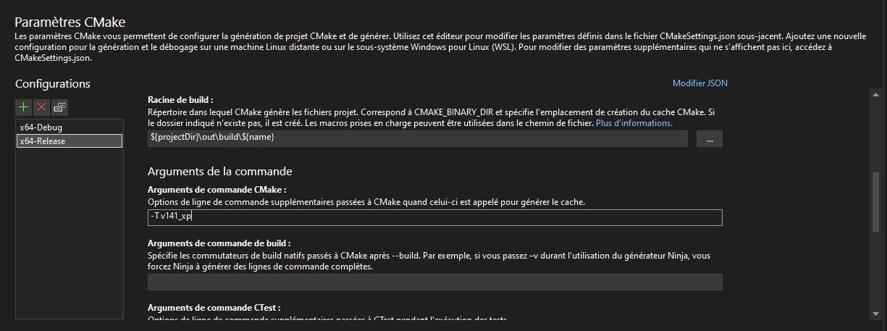

    Configuration details for "x64-Release", with the CMake command-line
    parameters being set to ``-T v141_xp``.

Scroll down more until you reach the "Display advanced parameters", on which
you must click:

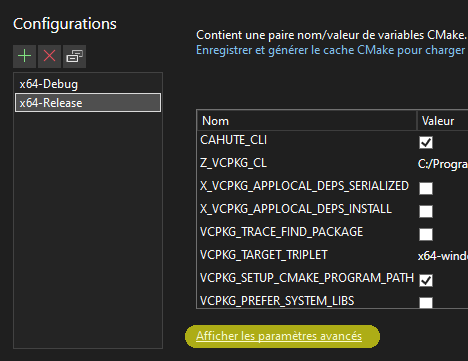

    Configuration details for "x64-Release", with the
    "Display advanced parameters" option highlighted.

You can now scroll down more to "CMake generator", which you must set to
``Visual Studio 17 2022``:

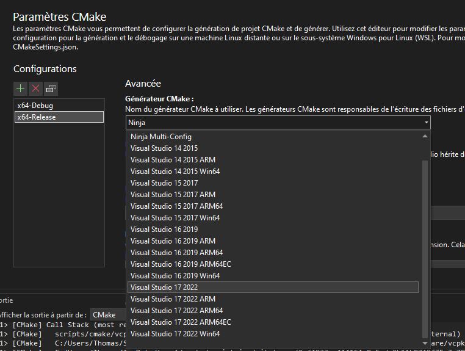

    Configuration details for "x64-Release", with the CMake generator
    being set to ``Visual Studio 17 2022``.

Once this is selected, you can save by clicking on the floppy on the top left
of the IDE, or using the Ctrl+S shortcut.

Building the project
~~~~~~~~~~~~~~~~~~~~

From here, you can select the target you want to build next to the green arrow
on the top, and the architecture you're targetting. By leaving the default
(``x64-Debug``) and clicking on ``p7.exe``, we obtain the following:

.. figure:: winvsb1.png

    Visual Studio, after building and running p7.

Since Cahute defines mostly command-line utilities, it may be more interesting
to have access to a command-line interface. In order to this, in the context
menu, select "Tools", "Command line", then "Developer Powershell":

.. figure:: winvsb2.png

    Visual Studio, with contextual menus opened up to "Developer Powershell".

A console should open at the bottom of the IDE. In this console, use ``cd``
to go to the build directory (by default, ``.\out\build\<target>``), and
run the command-line utilities from here with the options you want to test.

.. figure:: winvsb3.png

    A PowerShell developer console opened in Visual Studio, running p7 from
    the build directory directly.

.. note::

    If you are running the executables on another machine, you will need to
    install the Visual C++ Redistribuable Packages on said machine.

    If you've selected ``Visual Studio 17 2022``, you can download and install
    `Visual C++ Redistribuable for Visual Studio 2015`_ on the target machine
    before running the executable.

.. _build-guide-windows-vs-mingw:

Building Cahute for Microsoft Windows 2000 and above, using Visual Studio and MinGW-w64
---------------------------------------------------------------------------------------

.. warning::

    Both Windows XP and above as a target and this build method are not
    officially supported yet.

    See :ref:`feature-topic-system-windows` for more information.

It is possible to build Cahute for Windows XP, using Microsoft's
`Visual Studio`_ and `MinGW-w64`_.

Installing the required components
~~~~~~~~~~~~~~~~~~~~~~~~~~~~~~~~~~

You need to install MinGW-w64 first. Pre-built binaries are available;
for this, go to `MinGW-w64 Downloads`_ to the ``WinLibs.com`` section,
click on the link present in the section, then go to the ``Download``,
``Release versions``, ``MSVCRT runtime``, and select the latest archive for
Win64:

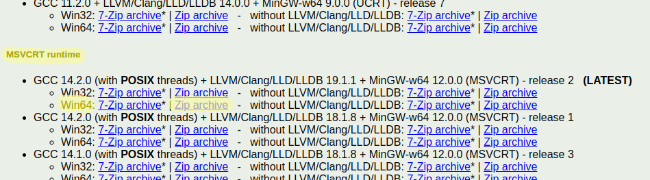

    A preview of the downloads section, with the link at roughly the correct
    position selected.

.. warning::

    You should only trust ``WinLibs.com`` as long as they are referenced on
    the MinGW-w64 website, as this website may be compromised at some point
    (possibly as you read this!).

Once you've downloaded the archive, you can open it, and move the ``mingw64``
directory it contains to any directory you like; for this guide, we will move
the directory to ``C:\``.

Setting up the project and configuration
~~~~~~~~~~~~~~~~~~~~~~~~~~~~~~~~~~~~~~~~

If you have not set up the project, **you must follow the instructions in**
:ref:`misc-guide-vs-clone`.

Once this is done, you need to go to the project's CMake configurations, by
going in "Project", then "CMake settings for cahute":

    Visual Studio, with the "CMake settings" menu selected.

Look for "Mingw64-Release" in the configuration list. If you do not have such a
configuration yet, click on the "+" icon:

    Configuration list, with the "+" button highlighted.

This will open a list of configurations to add. Look for "Mingw64-Release",
then click on "Select" at the bottom of the window:

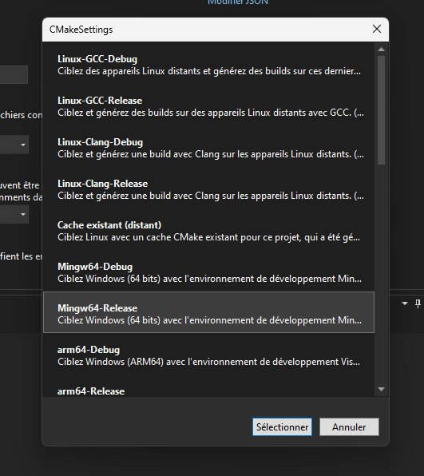

    Sample configuration list, with the "x64-Release" configuration
    highlighted.

Once this is selected, the new configuration should appear in your list.
Select it, then click on the configuration type to update its value
to "Release":

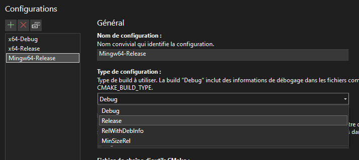

    Configuration details for "Mingw64-Release", with the configuration type
    dropdown selected and the "Release" option highlighted.

Now, click on "Modify JSON" on the top right corner of the CMake parameters.

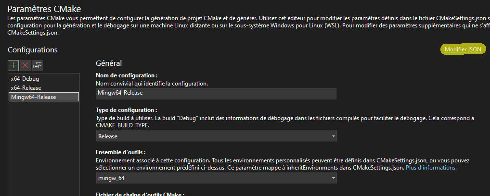

    Configuration details for "Mingw64-Release", with the "Modify JSON"
    option highlighted.

Look for the configuration with the "Mingw64-Release" name, then edit the
value for ``MINGW64_ROOT`` to the path where you put MinGW-w64, in this
example ``C:/mingw64``.

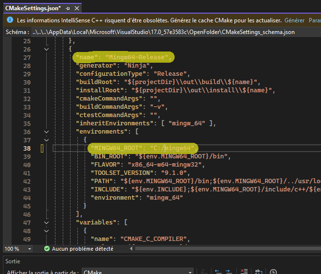

    JSON configuration details for "Mingw64-Release", with ``MINGW64_ROOT``
    highlighted and set to the value ``C:/mingw64``.

Once this is done, you can save by clicking on the floppy on the top left
of the IDE, or using the Ctrl+S shortcut.

Building the project
~~~~~~~~~~~~~~~~~~~~

From here, you can select the configuration you want on the left of the green
arrow, then pick the target you want to build on the right of the green arrow
on the top. By selecting ``Mingw64-Release`` and clicking on ``p7.exe``,
we obtain the following:

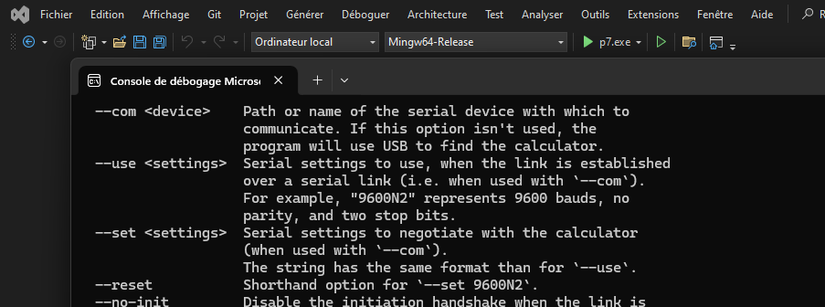

    Visual Studio, after building and running p7 using MinGW-w64.

Since Cahute defines mostly command-line utilities, it may be more interesting
to have access to a command-line interface. In order to this, in the context
menu, select "Tools", "Command line", then "Developer Powershell":

.. figure:: winvsb2.png

    Visual Studio, with contextual menus opened up to "Developer Powershell".

A console should open at the bottom of the IDE. In this console, use ``cd``
to go to the build directory (by default, ``.\out\build\<target>``), and
run the command-line utilities from here with the options you want to test.

.. figure:: winvsb3.png

    A PowerShell developer console opened in Visual Studio, running p7 from
    the build directory directly.

.. _build-guide-windows-mingw:

Building Cahute for Microsoft Windows 2000 and above, using |mingw-w64| MinGW-w64 on Archlinux
----------------------------------------------------------------------------------------------

.. warning::

    Both Windows XP and above as a target and this build method are not
    officially supported yet.

    See :ref:`feature-topic-system-windows` for more information.

Building Cahute for Windows XP and above from Archlinux_
using `MinGW-w64`_ is possible, as described in `Cross Compiling With CMake`_.

Downloading the Cahute source
~~~~~~~~~~~~~~~~~~~~~~~~~~~~~

.. include:: _download_source.rst

Installing the dependencies
~~~~~~~~~~~~~~~~~~~~~~~~~~~

You need to first install the required dependencies from the AUR, by using
your favourite AUR helper, e.g. with paru_::

    paru -S cmake python mingw-w64 mingw-w64-cmake mingw-w64-sdl3

Building the project
~~~~~~~~~~~~~~~~~~~~

In the parent directory to the source, you can now create the ``build``
directory aside it, by running either one of the following command depending
on the architecture you're targeting:

.. parsed-literal::

    i686-w64-mingw32-cmake -B build -S cahute-|version|
    x86_64-w64-mingw32-cmake -B build -S cahute-|version|

You can now build the project using the following command::

    cmake --build build

Before testing with either Wine or a Windows host, it is recommended to
copy the required shared libraries to the build directory, by running either
one of the following command depending on the architecture you're targetting::

    cp /usr/i686-w64-mingw32/bin/{libssp-0,SDL3}.dll .
    cp /usr/x86_64-w64-mingw32/bin/{libssp-0,SDL3}.dll .

.. note::

    For reference, this build method is used in the
    `MinGW build image for Cahute`_, which is exploited in the project's
    continuous integration pipelines as described in ``.gitlab-ci.yml``.

.. _build-guide-windows-ow-win32:

Building Cahute for Microsoft Windows 2000 and above, using |ow| Open Watcom on Archlinux
-----------------------------------------------------------------------------------------

.. warning::

    Both Windows XP and above as a target and this build method are not
    officially supported yet.

    See :ref:`feature-topic-system-windows` for more information.

Building Cahute for 32-bit Windows and above from Archlinux_ using OpenWatcom_
is possible.

Downloading the Cahute source
~~~~~~~~~~~~~~~~~~~~~~~~~~~~~

.. include:: _download_source.rst

Installing the dependencies
~~~~~~~~~~~~~~~~~~~~~~~~~~~

You need to first install the required dependencies from the AUR, by using
your favourite AUR helper, e.g. with paru_::

    paru -S cmake python openwatcom-v2

You must then define the ``WATCOM`` environment variable, by executing, or
adding the following lines to your rc file (e.g. ``~/.bashrc`` or ``~/.zshrc``)
then either resourcing it or starting up a new shell::

    export WATCOM=/opt/watcom
    export PATH="$WATCOM/binl:$PATH"

Building the project
~~~~~~~~~~~~~~~~~~~~

In the parent directory to the source, you can now create the ``build``
directory aside it, by running the following command:

.. parsed-literal::

    cmake -S cahute-|version| -B build -G "Watcom WMake" \\
        -DCMAKE_SYSTEM_NAME=Windows -DCMAKE_SYSTEM_PROCESSOR=x86 \\
        -DCAHUTE_SDL=OFF

You can now build the project using the following command::

    cmake --build build

.. _build-guide-windows-ow-win16:

Building Microsoft Cahute for Windows 1.x and above, using |ow| Open Watcom on Archlinux
----------------------------------------------------------------------------------------

.. warning::

    Both :ref:`Win16 <feature-topic-system-win16>` and this build method are
    not officially supported yet.

    See :ref:`feature-topic-system-windows` for more information.

Building Cahute for 16-bit Windows and above from Archlinux_ using OpenWatcom_
is possible.

Downloading the Cahute source
~~~~~~~~~~~~~~~~~~~~~~~~~~~~~

.. include:: _download_source.rst

Installing the dependencies
~~~~~~~~~~~~~~~~~~~~~~~~~~~

You need to first install the required dependencies from the AUR, by using
your favourite AUR helper, e.g. with paru_::

    paru -S cmake python openwatcom-v2

You must then define the ``WATCOM`` environment variable, by executing, or
adding the following lines to your rc file (e.g. ``~/.bashrc`` or ``~/.zshrc``)
then either resourcing it or starting up a new shell::

    export WATCOM=/opt/watcom
    export PATH="$WATCOM/binl:$PATH"

Building the project
~~~~~~~~~~~~~~~~~~~~

In the parent directory to the source, you can now create the ``build``
directory aside it, by running the following command:

.. parsed-literal::

    cmake -S cahute-|version| -B build -G "Watcom WMake" \\
        -DCMAKE_SYSTEM_NAME=Windows3x -DCMAKE_SYSTEM_PROCESSOR=x86

You can now build the project using the following command::

    cmake --build build

.. |win| image:: ../install/win.png

.. _Get notified when a release is created:
    https://docs.gitlab.com/user/project/releases/
    #get-notified-when-a-release-is-created
.. _Notifications: https://gitlab.com/-/profile/notifications

.. _cmake: https://cmake.org/
.. _Python: https://www.python.org/
.. _GNU Make: https://www.gnu.org/software/make/
.. _pkg-config: https://git.sr.ht/~kaniini/pkgconf
.. _SDL: https://www.libsdl.org/

.. _MinGW-w64: https://www.mingw-w64.org/
.. _OpenWatcom: https://openwatcom.org/
.. _Archlinux: https://archlinux.org/
.. _paru: https://github.com/Morganamilo/paru
.. _Cross Compiling With CMake:
    https://cmake.org/cmake/help/book/mastering-cmake/chapter/
    Cross%20Compiling%20With%20CMake.html?highlight=mingw
.. _MinGW build image for Cahute:
    https://gitlab.com/cahute/docker-images/-/blob/develop/mingw-w64/
    archlinux.Dockerfile?ref_type=heads

.. _Visual Studio: https://visualstudio.microsoft.com/fr/
.. _Visual C++ Redistribuable for Visual Studio 2015:
    https://www.microsoft.com/en-us/download/details.aspx?id=48145
.. _Installing and using packages (vcpkg):
    https://github.com/microsoft/vcpkg-docs/blob/main/vcpkg/examples/
    installing-and-using-packages.md#-step-2-use
.. _MinGW-w64 Downloads: https://www.mingw-w64.org/downloads/
