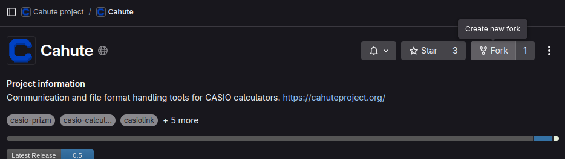
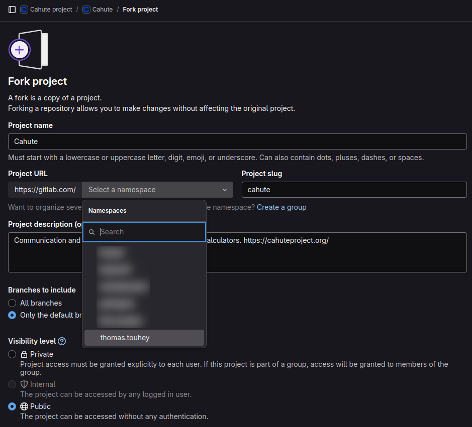
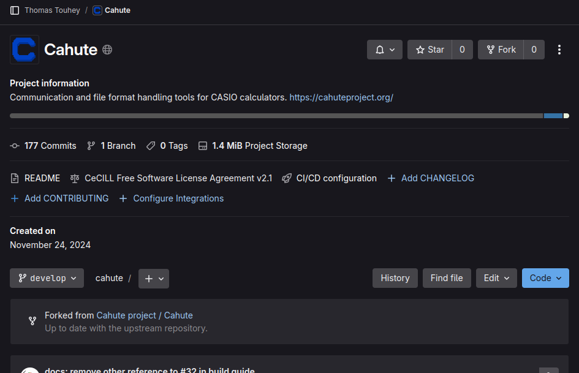
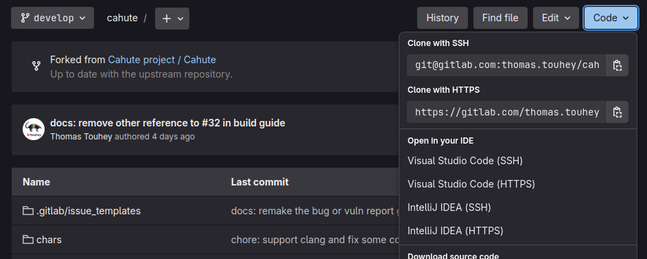
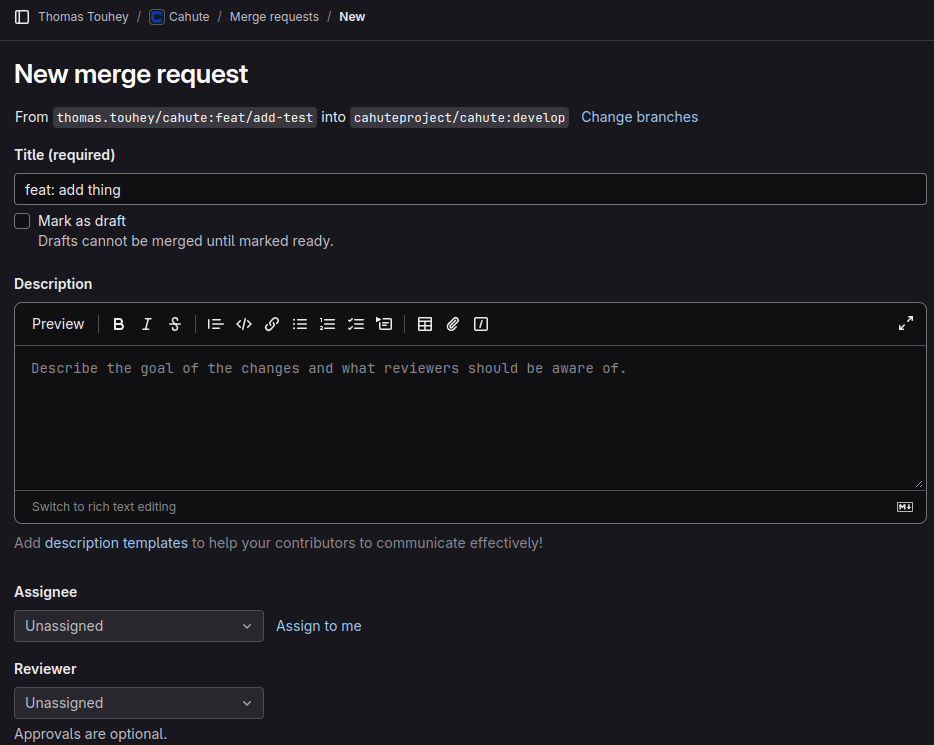
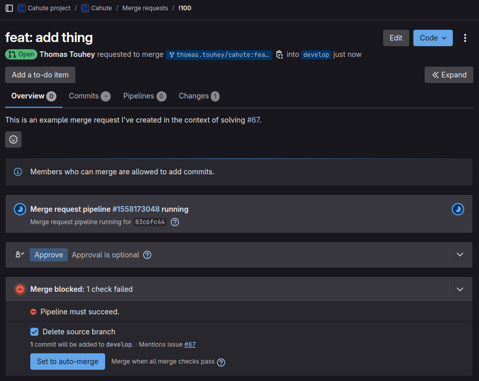
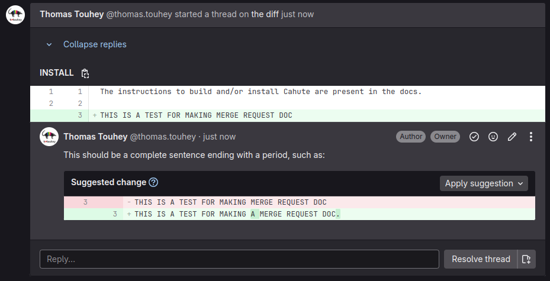

.. _contribution-guide-create-merge-request:

Creating a merge request
========================

In order to contribute modifications on the code, documentation, or most
elements pertaining to the Cahute project, you must create a `merge request`_
on the project's `Gitlab repository at gitlab.com/cahute/cahute
<Repository_>`_.

.. warning::

    This guide assumes some level of familiarity with Git_, and will suggest
    commands using the ``git`` program implementing the merge request process.

    If your contribution is simple and this process is overwhelming to you,
    you may be more comfortable with creating an issue; see
    :ref:`contribution-guide-report-issue` or
    :ref:`contribution-guide-request-feature` depending on your need.

.. warning::

    While Cahute may have mirrors on other forges, such as `on Github
    <Github mirror_>`_, **only merge requests on Gitlab.com can be accepted**.

Setting up the environment
--------------------------

This process requires having a `Gitlab.com`_ account.
If you do not yet have one, you must `sign up on Gitlab.com`_ to continue.

If you do not have a fork of the official repository yet, go to the
`cahute/cahute repository <Repository_>`_ and select "Fork":

    Cahute's official repository, with the "Fork" button highlighted.

Once you have selected the option, the following interface will be presented:

    Gitlab.com's forking interface for Cahute.

The following options are recommended:

* The namespace should be set to your username;
* The branches to include should be set to "only the default branch `develop`";
* The visibility level should be set to "Public";
* All other options can be left as is.

You must now select "Fork project" at the bottom left of the page; you may
need to scroll down if you do not see it.

After an optional loading screen, the fork project will be presented to you:

    Your fork of the Cahute repository.

From here, you must now follow the steps in :ref:`build-guide`, with the
exception of the cloning process which must use one of the URLs present
in the ``Code`` menu on your repository:

    Gitlab.com's repository interface with "Code" selected.

Creating your branch
--------------------

It is recommended not to create a merge request from the default branch
of your repository.

First, you must pick a branch name. Since you are on your own repository,
you can adopt whatever naming convention you wish, however you can choose
to stay consistent with the naming convention used on the official repository
described in :ref:`project-topic-git-repository-structure`, e.g.
``feat/add-ext-support`` or ``fix/remove-bad-packet-check-format``.

Once this is done, you can run the following command to move to your
branch::

    git switch -c <your-branch-name>

Making your modifications
-------------------------

Before you make any modifications, it is highly recommended you read the
following sections:

* :ref:`build-guide`;
* :ref:`project-topic-contribution-style` and :ref:`project-topic-coding-style`.

You can now create your commits and test your modifications.

Creating your merge request
---------------------------

Once you are happy with your branch locally, you can push it to the same
branch on your repository, with running the following command::

    git push --set-upstream origin <your-branch-name>

This will return a link to create the merge request, e.g.:

.. code-block:: text

    $ gp -u origin feat/add-test
    Énumération des objets: 5, fait.
    Décompte des objets: 100% (5/5), fait.
    Compression par delta en utilisant jusqu'à 8 fils d'exécution
    Compression des objets: 100% (3/3), fait.
    Écriture des objets: 100% (3/3), 331 octets | 331.00 Kio/s, fait.
    Total 3 (delta 2), réutilisés 0 (delta 0), réutilisés du paquet 0 (depuis 0)
    remote:
    remote: To create a merge request for feat/add-test, visit:
    remote:   https://gitlab.com/thomas.touhey/cahute/-/merge_requests/new?merge_request%5Bsource_branch%5D=feat%2Fadd-test
    remote:
    To ssh://gitlab.com/thomas.touhey/cahute.git
    * [new branch]      feat/add-test -> feat/add-test
    la branche 'feat/add-test' est paramétrée pour suivre 'origin/feat/add-test'.

By copying the link and navigating to it using a web browser, you will have
an interface such as this one:

    New merge request interface on Gitlab.com.

The following options are recommended:

* The title must include a prefix akin to the one of the branch, e.g.
  ``feat:`` if your branch name starts with ``feat/``.

  If your branch is only composed of one commit, the title will automatically
  be set to the title of the commit. Otherwise, it will be taken from the
  branch name, which will be incorrectly formatted; you must fix it yourself.
* If you want to create a merge request but are still actively working on your
  branch, you must set the ``Mark as draft`` checkbox. This will prompt
  maintainers to ignore the merge request for now.
* The description can be as verbose as you feel is needed.

  If your merge request aims at closing an issue, you must add a
  ``Closes: #<issue number>`` line at the end, separated from the rest
  by an empty line, e.g.::

      These commits add xyz, through the ``cahute_xyz()`` function.

      Closes: #12345

* It is recommended to set the "Delete source branch when merge request is
  accepted" option if you have not created the merge request from your default
  branch.
* It is recommended to set the "Allow commits from members who can merge the
  target branch" option, especially since the branch may need to be rebased
  before it can be merged if approved by maintainers.

Once all of the options have been filled, you can select "Create merge request"
at the bottom right; you may need to scroll down to see the button. It will
redirect to the created merge request:

    Your created merge request!

Note that you now have a CI running to automatically validate some elements
of your code. If this CI does not pass, your merge request will automatically
not be approved; you will need to fix it before any maintainer can approve
or review the merge request.

Passing the review process
--------------------------

Once the merge request is out there and the CI is passing, you need a
maintainer to review your merge request, and either open threads to request
changes or merge it.

.. warning::

    Due to the fact that Cahute is free software maintained by people on their
    free time, there is no guarantee of any delay, or even of a response or
    that the merge request won't be closed due to lack of availability on the
    maintainers' part.

    Note however that this warning is worst case scenario, and hopefully,
    it won't come to that for any valid merge request.

Threads may resemble this:

    A thread pointing to a line of code, with a remark and suggestion.

You can respond in a comment, and/or update your branch to correspond to the
provided remark, then notify the maintainer in the thread that the branch
has been modified following the review.

.. warning::

    **Do not make "apply suggestions" commits**: your commits must make sense
    outside of the review process once it is merged. Prefer amending commits,
    either using:

    * Commit amending, in case the modifications are only to be added to the
      last/only commit of the branch, e.g.::

          git add <pattern>
          git commit --amend

    * Interactive rebasing, e.g.::

          git rebase -i develop
          # Use the "edit" command on the commit you want to edit.
          git add <pattern>
          git rebase --continue

    * Fixup and autosquashing commits, e.g.::

          # For every commit to be amended:
          git add <pattern>
          git commit --amend
          # Finally:
          git rebase -i develop --autosquash
          # The fixup! commits will automatically be moved and use the "squash"
          # command.

    It is recommended to avoid adding ``fix:`` commits for bugs introduced on
    the same branch, although this is not a hard rule.

Since the upstream was set on your local branch already, you can update your
remote branch, and your merge request automatically, using the following
command::

    git push --force

.. warning::

    At any point, if the merge request is undesirable, mismanaged, or because
    of lack of action on your part, it may be closed by a maintainer.
    It is recommended only to reopen this merge request in the last case, and
    if you're able to be active again.

If everything goes well, your merge request should have been merged.
Congratulations!

.. _Repository: https://gitlab.com/cahute/cahute
.. _Github mirror: https://github.com/cahute/cahute

.. _Git: https://git-scm.com/
.. _Gitlab.com: https://about.gitlab.com/
.. _Merge request: https://docs.gitlab.com/user/project/merge_requests/
.. _Sign up on Gitlab.com: https://gitlab.com/users/sign_up
