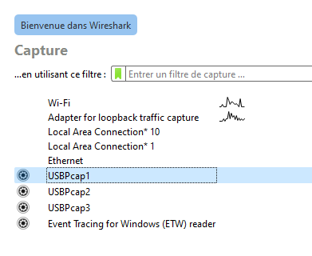
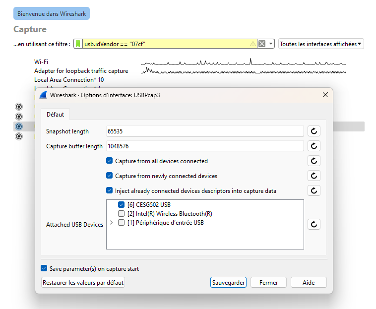
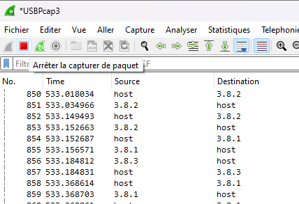
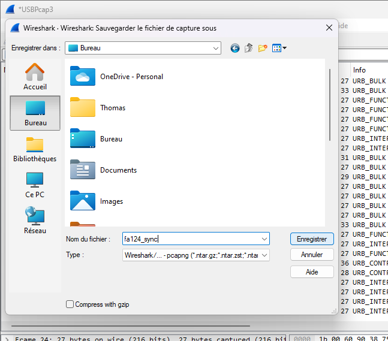
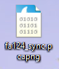

.. _misc-guide-capture-usb:

Capturing USB communications for CASIO calculators on Windows using Wireshark
=============================================================================

.. warning::

    This method requires a lot of tinkering, and is reserved for advanced
    users. If you do not feel comfortable with this guide, feel free to
    refuse or abandon at any point!

.. note::

    To bring more context, and if you feel yourself to be up to it, it is also
    possible to record your screen at the same time the capture is going on.

Sometimes, when dealing with exotic calculator models or cables, if you have
access to a Microsoft Windows machine, a maintainer may ask you to capture
communications from other software for analysis.

First, ensure that you have all of the official CESG502 driver from CASIO
by installing `FA-124`_, and rebooting your computer.

Then, you must download and install Wireshark_, and ensure that it comes
with **USBPCap**; see `Wireshark USB capture setup for Windows`_ for
more information.

You can now run Wireshark, and will see one ``USBPcap`` interface per USB
bus. You will need to determine on which will the calculator is present, and
filter on it to avoid including communication from other devices (which would
be a privacy breach for you!).

In order to accomplish this, you must first connect your calculator and place
it in Receive or USB Key mode, so that it is detected by the computer.

    Preview of the interface list, with the gear icon next to the ``USBPcap``
    interfaces.

Then, you can select the small gear icon next to every interface, until you
see one with "CESG502 USB".

    Options for one of the ``USBPcap`` interfaces, with the ``CESG502 USB``
    device appearing and checked.

You must select it, click on save (on the bottom of the window), then
double click on the interface to select it. You can now disable Receive or
USB Key mode on your calculator.

.. note::

    Wireshark unfortunately does not have an option to discard the first
    packets; you can help the reader distinguish what is part of the actual
    exchange by leaving a large enough interval at this point, e.g. 10 seconds.

From here, Wireshark is recording! You can run your test scenario, and
Wireshark will capture the communications between your computer and calculator.

Once your test is finished and the communication with the calculator is
terminated properly, you can select the button to stop the capture (red
square).

    Wireshark capture interface with the stop icon (red square) highlighted.

Once the capture has stopped, you must save the result by going to
``File > Save As`` in the contextual menu, then choosing a file name.

    Wireshark capture save interface.

The resulting file will have the ``.pcap`` or ``.pcapng`` extension, which you
can transmit to the maintainer **in a private manner**, as the file may contain
identifying information.

    Wireshark capture file preview on the Windows desktop.

.. _FA-124:
    https://www.planet-casio.com/Fr/logiciels/
    voir_un_logiciel_casio.php?showid=16
.. _Wireshark: https://www.wireshark.org/
.. _Wireshark USB capture setup for Windows:
    https://wiki.wireshark.org/CaptureSetup/USB#user-content-windows
