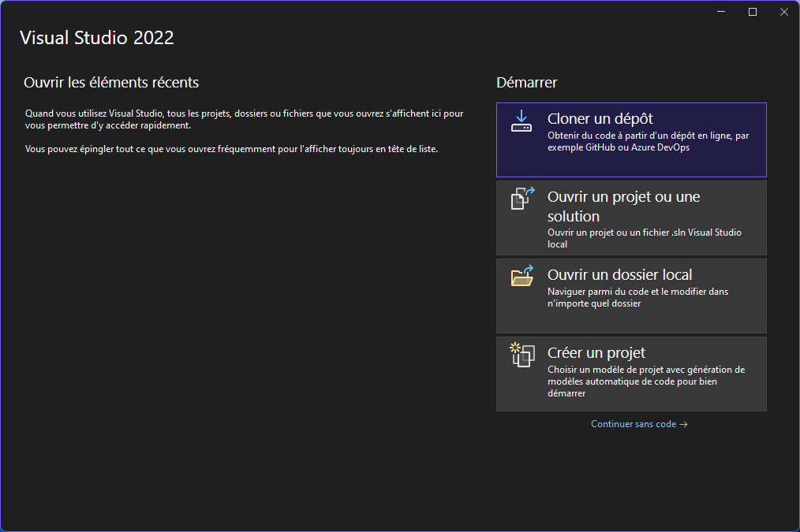
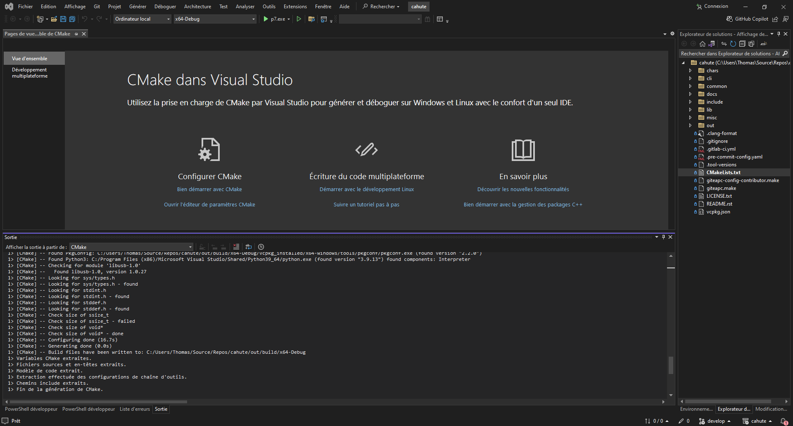

.. _misc-guide-setup-vs:

Getting started with Cahute in Visual Studio
============================================

It is possible to develop and build Cahute for various environments using
Microsoft's `Visual Studio`_ starting from version 17.6 (VS2022).

.. warning::

    Visual Studio is **not to be confused** with `Visual Studio Code`_, which
    is an entirely different program.

.. note::

    This version of Visual Studio is targeted since it is the first to
    include ``vcpkg`` (`source <vcpkg is Now Included with Visual Studio_>`_).
    It may be possible to compile Cahute on earlier versions of Visual
    Studio; see `Install and use packages with CMake`_ for more information.

.. _misc-guide-vs-clone:

Cloning the Cahute repository in Visual Studio
----------------------------------------------

When opening Visual Studio, select "Clone a repository" (first option).

    Initial window for Visual Studio, with the first option selected.

Enter the URL of the repository you're cloning
(``https://gitlab.com/cahute/cahute.git`` if cloning the upstream),
and select "Clone".

.. figure:: vscl2.png

    Repository cloning window, with the information filled out to clone
    the main branch on the official project repository.

.. warning::

    If you are building the project in the context of the
    :ref:`contribution-guide-create-merge-request` guide, the repository's URL
    is yours, not the repository's, and can be obtained through the ``Code``
    button on the Gitlab.com interface:

    .. figure:: ../contribution/mr4.png

        Gitlab.com's repository interface with "Code" selected, presenting
        the options to clone the repository.

.. note::

    The IDE may open to nothing much, such as in this example:

    .. figure:: vscl3.png

        Empty IDE windows, obtained after cloning the repository.

    In this case, double-clicking on "Directory view" in the Solution Explorer
    on the right should solve this.

Once the repository is loaded, the IDE should automatically prepare the
repository for building using CMake and vcpkg. The resulting view should
resemble this:

    Visual Studio, after the repository was successfully loaded and configured.

.. _misc-guide-vs-build:

Building Cahute
---------------

The following guides cover how to build Cahute for various platforms,
using Visual Studio:

* :ref:`build-guide-windows-vs`;
* :ref:`build-guide-windows-vs-xp`;
* :ref:`build-guide-windows-vs-mingw`.

.. _Visual Studio: https://visualstudio.microsoft.com/fr/
.. _Visual Studio Code: https://visualstudio.microsoft.com/fr/
.. _vcpkg is Now Included with Visual Studio:
    https://devblogs.microsoft.com/cppblog/
    vcpkg-is-now-included-with-visual-studio/
.. _Install and use packages with CMake:
    https://learn.microsoft.com/en-us/vcpkg/get_started/get-started
