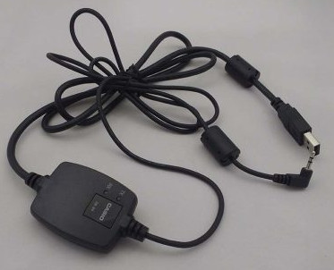
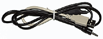
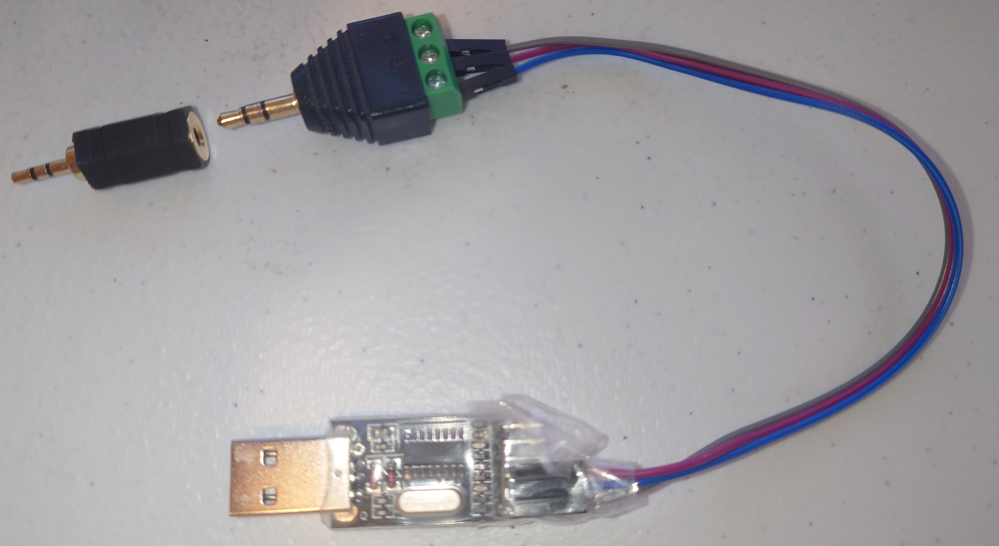
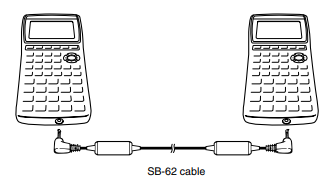
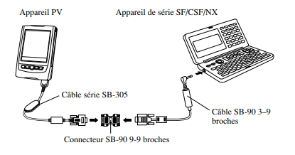
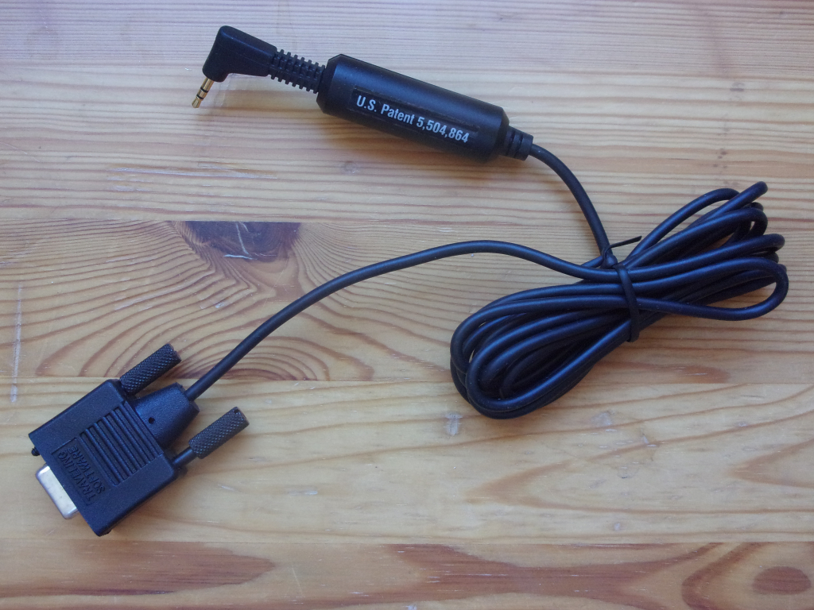
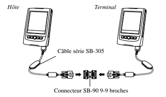

.. _protocol-topic-cables:

Communication cables
====================

This page references the known cables to interact with CASIO calculators,
using the ports described in :ref:`protocol-topic-ports`.

.. list-table::
    :header-rows: 1

    * - Device →

        Host ↓
      - 3-pin
      - PXH-A16
      - USB Mini-B
      - USB Type-C
    * - USB Type-A
      - :ref:`SB-88 <protocol-topic-cable-sb-88>`,
        :ref:`Util'Pocket USB cable
        <protocol-topic-cable-util-pocket-usb-cable>`
      - :ref:`SB-300 <protocol-topic-cable-sb-300>`
      - :ref:`USB Type-A to Mini-B <protocol-topic-cables-usb-mini-b>`
      - :ref:`USB Type-A to Type-C <protocol-topic-cables-usb-type-c>`
    * - 3-pin
      - :ref:`SB-62 <protocol-topic-cable-sb-62>`
      -
      -
      -
    * - RS-232 (DB-9)
      - :ref:`SB-87 <protocol-topic-cable-sb-87>`
      - :ref:`SB-305 <protocol-topic-cable-sb-305>`
      -
      -
    * - RS-232 (DB-25)
      - DB-25 with :ref:`FA-100 <protocol-topic-adapter-fa-100>`
      -
      -
      -

.. _protocol-topic-cables-usb-3pin:

USB Type-A to 3-pin cables
--------------------------

.. _protocol-topic-cable-sb-88:

SB-88 cable
~~~~~~~~~~~

The SB-88 and SB-88(A) cables are the USB Type-A to 3-pin cables distributed
with early 2000s fx-9860G derived models, as well as the AlgebraFX derivatives
in the same period.

See `Comment c'est fait un câble Casio FA-123/124 USB / SB-88 ?`_ (*in French*)
for more information on the internals of this cable.

    Depiction of an SB-88(A) cable. Source: ``casio880.com``

.. _protocol-topic-cable-util-pocket-usb-cable:

Util'Pocket CASIO calculator / PC cable
~~~~~~~~~~~~~~~~~~~~~~~~~~~~~~~~~~~~~~~

This USB Type-A to :ref:`3-pin <protocol-topic-port-3pin>` cable was made by
`Util-Pocket`_, a defunct French electronics vendor.

    CASIO / PC USB cable by `Util-Pocket`_. Source: `Util-Pocket USB cable`_
    (*Wayback Machine*)

.. _protocol-topic-cable-self-made-usb-cable:

Self-made USB Type-A to 3-pin cable
~~~~~~~~~~~~~~~~~~~~~~~~~~~~~~~~~~~

You can make your own USB Type-A to :ref:`3-pin <protocol-topic-port-3pin>`
cable. A myriad of tutorials are available out there; `this guide
<How to make your own PC to Casio calculator cable_>`_ has been known
to work for some people.

    Self-made USB Type-A to 3-pin cable made using the tutorial above.
    Source: `How to make your own PC to Casio calculator cable`_

.. _protocol-topic-cables-usb-pxh-a16:

USB Type-A to PXH-A16 cables
----------------------------

.. _protocol-topic-cable-sb-300:

SB-300 cable
~~~~~~~~~~~~

This USB Type A to :ref:`PXH-A16 <protocol-topic-port-pxh-a16>` cable is used
to connect a Classpad 300 to a PC through a USB port.

See :ref:`protocol-topic-port-pxh-a16` for more information on the cable's
pinout.

.. _protocol-topic-cables-usb-mini-b:

USB Type-A to Mini-B cables
---------------------------

.. todo:: Write this!

.. _protocol-topic-cables-usb-type-c:

USB Type-A to Type-C cables
---------------------------

.. todo:: Write this!

.. _protocol-topic-cables-3pin-3pin:

3-pin to 3-pin cables
---------------------

.. _protocol-topic-cable-sb-62:

SB-62 cable
~~~~~~~~~~~

This :ref:`3-pin <protocol-topic-port-3pin>` to 3-pin cable is provided with
most graphic calculators by CASIO.
It allows for calculator to calculator communication.

    SB-62 cable connecting two CASIO fx units.
    -- Section 21-1 (page 400), fx-9750G PLUS User's Guide, CASIO.

.. _protocol-topic-cables-db9-3pin:

RS-232 (DB-9) to 3-pin cables
-----------------------------

.. _protocol-topic-cable-sb-90-3-9:

3-9 pin SB-90 cable
~~~~~~~~~~~~~~~~~~~

This cable is used to connect a PV-S1600 or Classpad 300 with a CASIO
SF/CSF/NX unit, in conjunction with a :ref:`SB-305 cable
<protocol-topic-cable-sb-305>` and a :ref:`9-9 pin SB-90 cable
<protocol-topic-cable-sb-90-9-9>`.

    A CASIO PV-S1600 unit and a CASIO SF/CSF/NX unit connected together using
    an SB-305 cable, a 9-9 pin SB-90 cable, and a 3-9 pin SB-90 cable.
    -- "Communication entre un appareil PV et un appareil BN", section 12
    (page 128), PV-S1600, Mode d'emploi

.. _protocol-topic-cable-sb-87:

SB-87 / SB-125 / SB-150 / SB-155 cable
~~~~~~~~~~~~~~~~~~~~~~~~~~~~~~~~~~~~~~

The SB-87 / SB-125 / SB-150 / SB-155 cables are the DB-9 to 3-pin cables
used with the IBM PC in the 1990s.

.. note::

    The different denominations are likely due to different hardware revisions
    or manufacturers.

See `Histoire du câble Casio DB9 SB-87/125/150/155 FA-120/121/122`_
(*in French*) for more information.

    SB-87 cable. Source: `Histoire du câble Casio DB9
    SB-87/125/150/155 FA-120/121/122`_

.. _protocol-topic-cables-db9-pxh-a16:

RS-232 (DB-9) to PXH-A16 cables
-------------------------------

.. _protocol-topic-cable-sb-305:

SB-305 cable
~~~~~~~~~~~~

This DB-9 to :ref:`PXH-A16 <protocol-topic-port-pxh-a16>` cable is used to
connect a Classpad 300 to a PC through a DB-9 port, or to other devices;
see :ref:`protocol-topic-cable-sb-90-9-9` and
:ref:`protocol-topic-cable-sb-90-3-9` for more information.

.. _protocol-topic-cables-db25-3pin:

RS-232 (DB-25) to 3-pin cables
------------------------------

.. _protocol-topic-adapter-fa-100:

FA-100 adapter
~~~~~~~~~~~~~~

.. todo:: Write this!

.. _protocol-topic-cables-other:

Other cables
------------

.. _protocol-topic-cable-sb-90-9-9:

9-9 pin SB-90 cable
~~~~~~~~~~~~~~~~~~~

This cable is used to connect two PV-S1600 or Classpad 300 (if not using an
SB-62) together, in conjunction with two :ref:`SB-305 cables
<protocol-topic-cable-sb-305>`.

    Two CASIO PV-S1600 units connected together using two SB-305 cables,
    separated by a 9-9 pin SB-90 cable.
    -- "Communication entre deux appareils PV", Section 12 (page 124),
    PV-S1600, Mode d'emploi

.. _`Histoire du câble Casio DB9 SB-87/125/150/155 FA-120/121/122`:
    https://tiplanet.org/forum/viewtopic.php?t=26466&lang=en
.. _`Comment c'est fait un câble Casio FA-123/124 USB / SB-88 ?`:
    https://tiplanet.org/forum/viewtopic.php?t=14988
.. _Util-Pocket:
    https://web.archive.org/web/20160316001537/http://www.util-pocket.biz/
.. _Util-Pocket USB cable:
    https://web.archive.org/web/20160803203416/http://www.util-pocket.biz/
    catalog/product_info.php?cPath=104&products_id=122
.. _How to make your own PC to Casio calculator cable:
    https://www.planet-casio.com/Fr/forums/topic17865-1-
    besoin-de-cables-usbserie-bon-marche-pour-calculatrices-casio.html#198410
