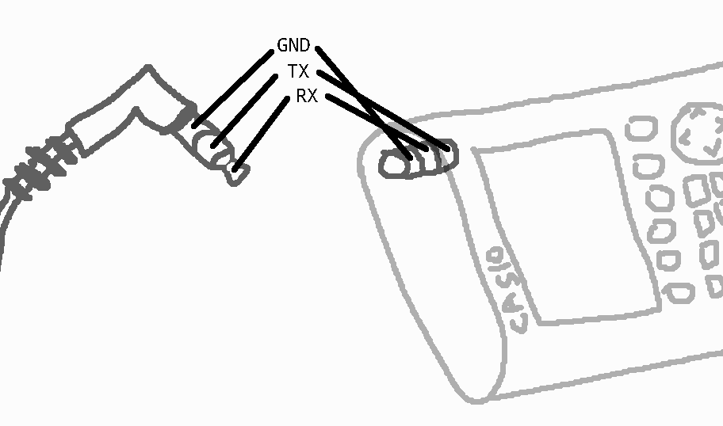

.. _protocol-topic-ports:

Communication ports
===================

Over the years, CASIO calculators have had various communication ports on
them.

.. _protocol-topic-port-3pin:

3-pin port
----------

    Representation of the 3-pin port and corresponding connector.

This communication port has been introduced with the fx-7800GC and
fx-8800GC (1992), and has been on every graphical CASIO calculator
since then.

The 3-pin communication port is a TRS Jack 2.5mm port, where:

* The tip is the RX port.
* The ring is the TX port.
* The sleeve is the GND port.

This port is used for serial communication with calculators, PCs, and other
CASIO units; see :ref:`protocol-topic-transport-serial` for more information.

The serial communication over RX/TX is similar to RS-232, with a voltage
level of 0V (GND) for logical 0, and for logical 1, either +4.5V for older
models, or +3.3V for newer ones.

.. _protocol-topic-port-pxh-a16:

PXH-A16 port
------------

This port was used on CASIO's Pocket Viewer and calculator units in 2003 and
2004, before they switched to USB Mini-B ports. It was conceived and
manufactured by `Honda connectors`_, with the following components:

* PXH-A16LMYG being the board receptable connector;
* PXH-A16FSG being the cable plug connector;
* PXH-A16SP being the backshell.

The port makes the calculator able to behave as both a USB and a serial device,
depending on the type of cable plugged into it. See
:ref:`protocol-topic-transport-serial` and :ref:`protocol-topic-transport-usb`
for more information.

In the case of a :ref:`USB Type-A to PXH-A16FSG cable
<protocol-topic-cable-sb-300>`, the pinout is the following:

.. code-block:: text

    USB Type-A                 PXH-A16FSG

                         +V
    1 RED ----------------------------- 1

                      DATA (-)
    2 WHITE --------------------------- 5

                      DATA (+)
    3 GREEN --------------------------- 6

                        GND
    4 BLACK -------------------------- 16

.. _protocol-topic-port-usb-mini-b:

USB Mini-B port
---------------

With the introduction of the fx-9860G and Classpad 300+ in 2005, CASIO started
adding an USB Mini-B port to its calculators, replacing in the case of the
Classpad the :ref:`protocol-topic-port-pxh-a16`.

See :ref:`protocol-topic-transport-usb` and :ref:`protocol-topic-usb-detection`
for more information.

.. _protocol-topic-port-usb-type-c:

USB Type-C port
---------------

With the introduction of the Graph Math+ in 2024, CASIO replaced the
:ref:`protocol-topic-port-usb-mini-b` with a USB Type-C port.

This port however still presents the same interfaces as
:ref:`USB Mini-B <protocol-topic-port-usb-mini-b>`.

See :ref:`protocol-topic-transport-usb` and :ref:`protocol-topic-usb-detection`
for more information.

.. _Honda connectors: https://product.htk-jp.com/EN-top1
