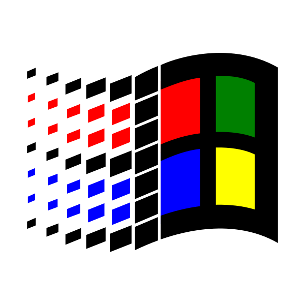

System compatibility
====================

Cahute is compatible with multiple host systems and system libraries.
The following sections represents these.

.. warning::

    Some sections are present in this document for reference, and the presence
    of a section in this document does not mean the system is currently
    supported; it does mean however that support for the platform is
    considered.

.. note::

    We consider that Cahute officially supports a platform (system with
    specific components, such as the C library, and so on) when:

    1. Cahute can be built for the platform from Linux, using
       freely-distributed software;
    2. Cahute can run and access at least one system resource relevant to
       its function (at least one serial port, some USB devices, or the
       filesystem);
    3. Cahute build for the platform is integrated within the project's CI;
    4. Cahute can be installed without being manually built on or for the
       platform, using a package manager or an installer distribution.

    Also note that requirement 1 does not imply that all build methods have
    to use freely-distributed software, we only need one to be.

.. _feature-topic-system-linux:

|linux| Linux distributions
---------------------------

Linux_ is only a kernel, which has spawned multiple distributions around it
considered systems on which Cahute can run. Their support is one of the main
reasons why alternative tooling to CASIO's own exist in the first place, which
is only distributed on Microsoft Windows.

Officially supported targets for Linux are the following:

.. list-table::
    :header-rows: 1

    * - Processor architecture
      - C library
      - Target
    * - x86_
      - `GNU C library`_
      - ``i686-pc-linux-gnu``
    * - x64_
      - `GNU C library`_
      - ``x86_64-pc-linux-gnu``
    * - x86_
      - `musl libc`_
      - ``i686-pc-linux-musl``
    * - x64_
      - `musl libc`_
      - ``x86_64-pc-linux-musl``

In addition to the binary compatibility, details such as the filesystem
hierarchy must be examined. By default, Cahute assumes the
`Filesystem Hierarchy Standard`_ (FHS), which for example defines that devices
are present in ``/dev``.

Build instructions for Linux are distribution-agnostic, and the built project
is selected based on every distribution's configuration.
See :ref:`build-guide-linux` for more information.

.. _feature-topic-system-arch:

|archlinux| Archlinux and derivatives
~~~~~~~~~~~~~~~~~~~~~~~~~~~~~~~~~~~~~

.. include:: ../../guides/_system_guides_arch.rst

Archlinux_ is a Linux distribution based on the Pacman_ / libalpm_ package
manager.
Many distributions are based on it, with one of the more well-known ones being
Manjaro_. It uses the `GNU C library`_.

.. _feature-topic-system-debian:

|debian| Debian and derivatives
~~~~~~~~~~~~~~~~~~~~~~~~~~~~~~~

.. include:: ../../guides/_system_guides_debian.rst

Debian_ is a Linux distribution based on APT_ (*Advanced Package Tool*).
Many distributions are based on it, with some of the more well-known ones
being Ubuntu_ and `Linux Mint`_. It uses the `GNU C library`_.

.. _feature-topic-system-redhat:

|redhat| RHEL and derivatives
~~~~~~~~~~~~~~~~~~~~~~~~~~~~~

.. include:: ../../guides/_system_guides_redhat.rst

RHEL_ (*Red Hat Enterprise Linux*) is a Linux distribution made by `Red Hat`_
and based on RPM_. Some distributions are based on it, including CentOS_.

.. _feature-topic-system-macos:

|apple| macOS, OS X
-------------------

.. include:: ../../guides/_system_guides_macos.rst

`macOS / OS X`_ is, in this context, an alias for Darwin_, a system based on
XNU_ developed by Apple_ for its Mac_ computers, among others.
It is derived from BSD_, among other systems.

Support for this platform is mostly common with other UNIX-like platforms
such as Linux_, and most of the platform-specific code is handled by libusb_.
The following is implemented in Cahute directly:

* macOS does not allow detaching the kernel driver for USB devices, unless
  it is `code signed <Apple code signing_>`_. Cahute ignores access-related
  errors on kernel driver detaching for this reason;
* Like for other BSD_ systems, serial devices are present in ``/dev`` as
  ``cu.*`` and ``cuad.*`` devices, instead of ``ttyUSB*`` for Linux.

Installation on macOS / OS X of Cahute is done via Homebrew_, which requires
macOS Sonoma (14) or higher; see :ref:`install-guide-macos` and `Homebrew macOS
requirements`_ for more information.

.. _feature-topic-system-windows:

|win| Microsoft Windows
-----------------------

.. include:: ../../guides/_system_guides_win.rst

`Microsoft Windows`_ is a family of operating systems made by Microsoft_
since the 1980s, bearing multiple programmation interfaces, described in the
following subsections.

.. _feature-topic-system-win16:

|win31| Win16
~~~~~~~~~~~~~

Win16 is the 16-bit Windows API, only present on the x86_ architecture,
first introduced with `Windows 1.0`_ in 1985.
It is supported by the following systems:

* MS-DOS based Windows systems, up to and including `Windows 3.x`_;
* Windows systems from the `Windows 9x`_ series, using MS-DOS as a bootloader
  (see `What was the role of MS-DOS in Windows 95?`_ for more information),
  including `Windows 95`_, `Windows 98`_ and `Windows Me`_ (*Millenium
  Edition*);
* `Windows NT`_ based Windows systems up to and including `Windows 2000`_
  (NT 5.0).

See :ref:`internals-topic-win16` for more information.

.. _feature-topic-system-win32:

|win| Win32
~~~~~~~~~~~

Win32, sometimes also named "Win32s" or "Win32c", is the 32-bit Windows API,
present on the x86_ (i686+) and x64_ architectures, first introduced with
`Windows NT 3.1`_ in 1993.
It is supported by the following systems:

* `Windows NT`_ based Windows systems starting from `Windows NT 3.1`_
  up until now;
* Windows systems from the `Windows 9x`_ series, including `Windows 95`_,
  `Windows 98`_ and `Windows Me`_.

.. note::

    The `Windows 9x`_ series only support a subset of Win32, also known
    as "Win32s".

C/C++ programs using this interface can have one of two existing runtimes:

* Microsoft Visual C++ Runtime (MSVCRT), available by default on NT 3.1+;
* Universal C Runtime (UCRT), only available by default on NT 10.0
  (Windows 10), and through updates on NT 6.0 (Windows Vista) and above;
  see `Universal CRT deployment`_ for more information.

See `UCRT vs. MSVCRT`_ for more information.

One can make use of `MinGW-w64`_ in order to build from Windows itself without
Microsoft's C libraries exclusively distributed with `Visual Studio`_, or
from other platforms such as Linux. See :ref:`build-guide-windows` for more
details.

Cahute currently supports Win32 starting from `Windows 2000`_ (NT 5.0), for
both the UCRT and MSVCRT runtimes. See :ref:`internals-topic-win32` for
more information.

.. _feature-topic-system-win32-drivers:

Win32 drivers for CASIO calculators over USB
^^^^^^^^^^^^^^^^^^^^^^^^^^^^^^^^^^^^^^^^^^^^

As opposed to other platforms and interfaces, Cahute cannot access USB devices
on calculators, but must make use of a driver specifically installed for the
calculator.

Possible drivers include the following:

.. list-table::
    :header-rows: 1

    * - Name
      - Description
      - Compatibility
      - Implementation status
    * - Generic volume driver
      - Driver by Microsoft_, automatically used when a device presents
        a **USB Mass Storage** interface descriptor.
      - Windows 2000 (NT 5.0)+
      - :ref:`Implemented <internals-topic-win32-volmgr>`
    * - CESG502_
      - CASIO's official driver for :ref:`serial over USB bulk devices
        <protocol-topic-transport-serial-over-usb-bulk>`, matching USB
        devices presenting the ``07cf:6101`` VID/PID pair.

        32-bit (x86_) drivers can be found `here <32-bit CESG502 driver_>`_,
        and 64-bit (x64_) drivers are installed with `FA-124`_;
      - Windows 2000 (NT 5.0)+
      - :ref:`Implemented <internals-topic-win32-cesg>`
    * - WinUSB_
      - Generic USB device driver by Microsoft.

        Can be selected automatically if the calculator presents WCID_
        attributes.
      - Windows Vista (NT 6.0)+
      - :ref:`Implemented <internals-topic-win32-winusb-bulk>`
    * - `libusbK.sys`_
      - Generic KMF-based USB device driver provided by libusbK_, a third-party
        library.
      - Windows XP (NT 5.1)+
      - Not implemented
    * - `libusb0.sys`_
      - Generic USB device driver provided by `libusb-win32`_, a third-party
        library implementing the libusb_ 0.1 API.
      - Windows 2000 (NT 5.0)+\ [#libusb0-compat]_
      - Not implemented
    * - UsbDk_
      - Generic USB device driver provided by the eponym, third-party
        component.
      - Windows XP (NT 5.1)+
      - Not implemented

See `libusb-compatible kernel drivers`_ for more information on generic
USB device drivers for Win32.

.. _feature-topic-system-amigaos:

|amigaos| AmigaOS and derivatives
---------------------------------

.. include:: ../../guides/_system_guides_amigaos.rst

AmigaOS_ is a system originally made by Commodore_ for the Amiga_ family of
computers. Versions 3.2+ of the system were made by `Hyperion Entertainment`_,
which `went bankrupt in March of 2024 <Hyperion Entertainment bankrupcy_>`_.

There were some community-made `CASIO software for AmigaOS`_ in the early
2000s, including Amicas_ and ACas_ which both implemented
:ref:`CAS50 <protocol-topic-cas50>` over serial links.

Cahute can be built for AmigaOS 3.1+ using the Native Development Kit (NDK),
which can be found in the `Hyperion Entertainment Downloads`_. See
:ref:`build-guide-amigaos` for more details.

While AmigaOS doesn't natively support USB, it can through USB stacks such
as |amigaos-poseidon| \ Poseidon_.

.. _feature-topic-system-aros:

|aros| AROS
~~~~~~~~~~~

AROS_ is a derivative of AmigaOS.

.. todo:: Write this!

.. _feature-topic-system-morphos:

|morphos| MorphOS
~~~~~~~~~~~~~~~~~

MorphOS_ is a derivative of AmigaOS.

.. todo:: Write this!

.. [#libusb0-compat] Only up to libusb-win32 1.2.6.0 (released on
   2012-01-17). Versions from 1.2.7.1 (released on 2019-09-18) to
   1.2.7.4 (released on 2023-09-20) are only compatible with
   Windows 7 (NT 6.1)+, and versions starting from 1.3.0.0 (released on
   2023-10-03) are only compatible with Windows 10 (NT 10.0)+.
   See `libusb-win32 compatibility`_ for more information.

.. |linux| image:: ../../guides/install/linux.svg
.. |archlinux| image:: ../../guides/install/arch.svg

.. |redhat| image:: ../../guides/install/redhat.svg

.. |amigaos| image:: ../../guides/install/amigaos.png

.. _x86: https://fr.wikipedia.org/wiki/X86
.. _x64: https://fr.wikipedia.org/wiki/X64

.. _GNU C library: https://www.gnu.org/software/libc/
.. _musl libc: https://musl.libc.org/
.. _libusb: https://libusb.info/

.. _Linux: https://kernel.org/
.. _Filesystem Hierarchy Standard:
    https://refspecs.linuxfoundation.org/FHS_3.0/fhs/index.html
.. _Archlinux: https://archlinux.org/
.. _Pacman: https://wiki.archlinux.org/title/Pacman
.. _libalpm: https://man.archlinux.org/man/libalpm.3
.. _Manjaro: https://manjaro.org/
.. _Archlinux User Repository: https://aur.archlinux.org/
.. _cahute on AUR: https://aur.archlinux.org/packages/cahute

.. _Debian: https://www.debian.org/
.. _APT: https://wiki.debian.org/PackageManagement
.. _Ubuntu: https://ubuntu.com/
.. _Linux Mint: https://www.linuxmint.com/

.. _RHEL:
    https://www.redhat.com/en/technologies/linux-platforms/enterprise-linux
.. _CentOS: https://www.centos.org/
.. _Red Hat: https://www.redhat.com/
.. _RPM: https://rpm.org/

.. _`macOS / OS X`: https://www.apple.com/macos/
.. _Darwin: https://en.wikipedia.org/wiki/Darwin_(operating_system)
.. _XNU: https://en.wikipedia.org/wiki/XNU
.. _Apple: https://www.apple.com/
.. _Mac: https://www.apple.com/mac/
.. _BSD: https://en.wikipedia.org/wiki/Berkeley_Software_Distribution
.. _Apple code signing:
    https://developer.apple.com/library/archive/documentation/Security/
    Conceptual/CodeSigningGuide/Introduction/Introduction.html
.. _Homebrew: https://brew.sh/
.. _Homebrew macOS requirements:
    https://docs.brew.sh/Installation#macos-requirements

.. _MS-DOS: https://en.wikipedia.org/wiki/MS-DOS

.. _`OS/2`: https://en.wikipedia.org/wiki/OS/2
.. _IBM: https://www.ibm.com/

.. _Microsoft Windows: http://windows.microsoft.com/
.. _Microsoft: https://www.microsoft.com/
.. _Windows 1.0: https://fr.wikipedia.org/wiki/Windows_1.0
.. _Windows 3.x: https://fr.wikipedia.org/wiki/Windows_3.x
.. _Windows 9x: https://en.wikipedia.org/wiki/Windows_9x
.. _Windows 95: https://en.wikipedia.org/wiki/Windows_95
.. _Windows 98: https://en.wikipedia.org/wiki/Windows_98
.. _Windows Me: https://en.wikipedia.org/wiki/Windows_Me
.. _Windows NT: https://en.wikipedia.org/wiki/Windows_NT
.. _Windows NT 3.1: https://en.wikipedia.org/wiki/Windows_NT_3.1
.. _Windows 2000: https://en.wikipedia.org/wiki/Windows_2000
.. _`What was the role of MS-DOS in Windows 95?`:
    https://devblogs.microsoft.com/oldnewthing/20071224-00/?p=24063
.. _Visual Studio: https://visualstudio.microsoft.com/fr/
.. _Universal CRT deployment:
    https://learn.microsoft.com/en-us/cpp/windows/universal-crt-deployment
.. _UCRT vs. MSVCRT:
    https://sourceforge.net/p/mingw-w64/mingw-w64/ci/master/tree/mingw-w64-doc/
    howto-build/ucrt-vs-msvcrt.txt
.. _MinGW-w64: https://www.mingw-w64.org/

.. _CESG502:
    https://www.planet-casio.com/Fr/logiciels/voir_un_logiciel_casio.php
    ?showid=75&page=10
.. _32-bit CESG502 driver:
    https://www.planet-casio.com/Fr/logiciels/voir_un_logiciel_casio.php
    ?showid=75
.. _FA-124:
    https://www.planet-casio.com/Fr/logiciels/voir_un_logiciel_casio.php
    ?showid=16
.. _WinUSB:
    https://learn.microsoft.com/fr-fr/windows-hardware/drivers/usbcon/
    using-winusb-api-to-communicate-with-a-usb-device
.. _libusbK: https://libusbk.sourceforge.net/UsbK3/index.html
.. _`libusbK.sys`:
    https://libusbk.sourceforge.net/UsbK3/usbk_about.html#usbk_about_sys
.. _libusb-win32: https://github.com/mcuee/libusb-win32
.. _libusb-win32 compatibility:
    https://github.com/mcuee/libusb-win32/wiki#libusb-win32
.. _`libusb0.sys`:
    https://github.com/mcuee/libusb-win32/wiki#development
.. _UsbDk: https://github.com/daynix/UsbDk
.. _libusb-compatible kernel drivers:
    https://github.com/libusb/libusb/wiki/
    Windows#user-content-Driver_Installation
.. _WCID: https://github.com/pbatard/libwdi/wiki/WCID-Devices

.. _AmigaOS: https://www.amigaos.net/
.. _Amiga: https://en.wikipedia.org/wiki/Amiga
.. _Commodore: https://en.wikipedia.org/wiki/Commodore_International
.. _Hyperion Entertainment:
    https://www.hyperion-entertainment.com/
.. _Hyperion Entertainment bankrupcy:
    https://www.amiga-news.de/en/news/AN-2024-04-00029-EN.html
.. _CASIO software for AmigaOS:
    https://aminet.net/search?query=casio
.. _Poseidon: https://aminet.net/package/driver/other/PoseidonMain
.. _Amicas: https://aminet.net/package/comm/misc/amicas
.. _ACas: https://aminet.net/package/comm/misc/ACas
.. _Hyperion Entertainment Downloads:
    https://www.hyperion-entertainment.com/index.php/downloads

.. _AROS: http://www.aros.org/

.. _MorphOS: https://morphos-team.net/
