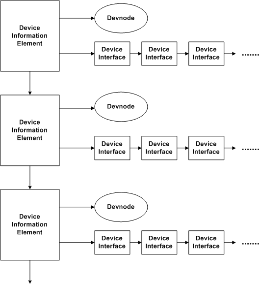

.. _internals-topic-win32:

Win32 specific implementation details
=====================================

This document details implementation details specific to Cahute's usage
of :ref:`feature-topic-system-win32`.

Serial device management
------------------------

Serial devices drivers are uniform across serial and USB-serial drivers
with Win32; see `Serial Communications in Win32`_ for more information.

Serial device detection using the Win32 API
~~~~~~~~~~~~~~~~~~~~~~~~~~~~~~~~~~~~~~~~~~~

In order to list available serial devices using Win32, the
``HKEY_LOCAL_MACHINE\HARDWARE\DEVICEMAP\SERIALCOMM`` registry key
contents is read, therefore making the same operations as |GetCommPorts|_
with better compatibility.

.. _internals-topic-win32-serial-link:

Serial link handling using the Win32 API
~~~~~~~~~~~~~~~~~~~~~~~~~~~~~~~~~~~~~~~~

Cahute can open a serial link using the Win32 API with the
``cahute_open_win32_serial_link()`` function.

This function interprets the provided name or path as a path,
and attempts at opening the device using |CreateFile|_.
If it succeeds, it calls |SetCommTimeouts|_ with ``ReadTimeoutInterval`` set
to ``MAXDWORD`` in order to only read what is directly available, and create
the event for the overlapped object using |CreateEvent|_.

If it succeeds, the link can then be opened, with a |HANDLE|_ with
`Overlapped I/O`_ and an internal buffer.

The available operations use :

* Closing uses |CloseHandle|_ and, optionally, |CancelIo|_;
* Receiving uses |ReadFile|_, |WaitForSingleObject|_, and
  |GetOverlappedResult|_;
* Sending uses |WriteFile|_ and |WaitForSingleObject|_, and depending
  on whether the second function succeeded or not, either
  |GetOverlappedResult|_ or |CancelIo|_, to ensure we don't have any
  buffer reads post-freeing the link;
* Serial params setting uses |SetCommState|_.

.. note::

    If |WaitForSingleObject|_ on receiving ends with ``WAIT_TIMEOUT``, i.e.
    if a timeout has occurred, rather than cancelling the call, the
    respective function lets the call continue in the background.

    This is because the function is also used by the CESG driver usage
    implementation in Cahute, which may crash under some circumstances
    when trying to cancel an overlapped read call; see
    `#17 <https://gitlab.com/cahute/cahute/-/issues/17>`_
    for more information.

    The same overlapped event is used between calls to the receive
    implementation, until it completes or the link is closed.

    Rather than reading directly in the provided buffer, the implementation
    reads into an internal buffer first, then copies the contents read
    in the internal buffer in the provided buffer. This is because, while
    the provided buffer may change from one call to the other, the internal
    buffer doesn't, and the operation can safely continue asynchronously
    in between calls.

Other device management
-----------------------

The device tree model used by Cahute is implemented starting from
Windows 2000 (NT 5.0). Said model has concepts of devices and device
interfaces.

Devices are structured in a tree, meaning a device can have a parent
(unless it is at root), and can have children. A device:

* Has an identifier, as a unique string (e.g. ``ACPI\PNP0200\4&1d401fb5&0``
  or ``USB\Vid_07cf&Pid_6101\5&18f54cb7&0&2``);
* Has a class, also known as `setup classes
  <Overview of device setup classes_>`_, represented as a GUID (UUID);
* Can have one or more interfaces which each have `classes <Overview of
  device interface classes_>`_, represented as a GUID (UUID).

When making a device query, the result can be navigated as a
`device information set <Device Information Sets_>`_:

    A diagram showing the internal structure of a device information set.

While Windows Vista and later versions of Windows support a
`Unified Device Property Model`_ which allows an application to retrieve
a device from a device interface, earlier versions up to and including
Windows 2000 have `a more basic model <Device Property Representations before
Windows Vista_>`_.

Cahute can query devices and device interfaces using either SetupApi_ and
CfgMgr32_; Microsoft `recommends the latter <Porting code from SetupApi to
CfgMgr32_>`_, so Cahute uses it exclusively.

.. _internals-topic-win32-device-enum:

Device detection using CfgMgr32 (Win32)
~~~~~~~~~~~~~~~~~~~~~~~~~~~~~~~~~~~~~~~

Cahute can detect drivers using CfgMgr32_ on Win32 with the following
filters:

* An optional device identifier for which to find bus relations.

  An example use of this by Cahute is to find the disk drive associated with
  a USB device, by placing the identifier of the USB device in this filter.
* An optional device identifier for which to find removal relations.

  Some relations between devices are not simple bus relations, but "removal"
  relations, meaning removing the first device removes the second one as well.
  An example in Cahute is with USB Mass Storage devices, where volumes are
  not directly associated with the disk drive through bus relations, but
  through removal relations.
* An optional device (setup) class GUID.

  This filters on devices with that class only, in order to look for e.g. USB
  devices, disk drives or volumes only rather than all devices on the system.

  With Windows 7 and later systems, this can be passed to Cfgmgr32 directly
  using |CM_GETIDLIST_FILTER_CLASS|_. Otherwise, all devices are returned
  by CfgMgr32, and Cahute queries and filters on the device class directly.
* An optional interface class GUID.

  If passed, Cahute ensures that there exists at least one device interface
  for that device with this class.

.. note::

    Since for systems older than Windows Vista, it is not possible to
    retrieve the device from a device interface, if that last filter is set,
    Cahute iterates over the devices, and calls
    |CM_Get_Device_Interface_List_SizeA|_ for every one.

In order to do so, it does the following in
``cahute_enumerate_win32_devices()``:

* It calls |CM_Get_Device_ID_List_SizeA|_ then |CM_Get_Device_ID_ListA|_
  with parameters computed from the filters and the current Windows version;
* For each device:

  - It obtains the device instance using |CM_Locate_DevNodeA|_, in order to
    use it to query device properties;
  - It obtains the device address using |CM_Get_DevNode_Registry_PropertyA|_
    with ``CM_DRP_ADDRESS`` (eq. to ``SPDRP_ADDRESS`` or
    ``DEVPKEY_Device_Address``).

    This address may be useful. For example, with USB, it represents the index
    of the port on which the USB device is plugged, and allows for querying
    USB-specific information later on;
  - It obtains the device class using |CM_Get_DevNode_Registry_PropertyA|_
    with ``CM_DRP_CLASSGUID`` (eq. to ``SPDRP_CLASSGUID`` or
    ``DEVPKEY_Device_ClassGuid``).

    If the device class filter has been set and has not been passed in the
    call to |CM_Get_Device_ID_ListA|_, this is used to make that check.
  - It obtains the service using |CM_Get_DevNode_Registry_PropertyA|_
    with ``CM_DRP_SERVICE`` (eq. to ``SPDRP_SERVICE`` or
    ``DEVPKEY_Device_Service``).

    This is used later on, to find out which driver runs on a USB device;
  - It obtains the driver name and version using |CM_Open_DevNode_Key|_ with
    ``CM_REGISTRY_SOFTWARE``, then |RegQueryValueExA|_ with
    ``REGSTR_VAL_DRVDESC`` (eq. to ``DEVPKEY_Device_DriverDesc``)
    and ``REGSTR_VAL_DRIVERVERSION`` (eq. to ``DEVPKEY_Device_DriverVersion``),
    then closing the handle using |RegCloseKey|_.

    This is used later on, to implement more conditions on the driver.
    See `Accessing device driver properties`_ for more information.
  - If the address or the device class could not be gathered, the
    device is skipped.
  - If the interface class filter was set,
    |CM_Get_Device_Interface_List_SizeA|_ is set with the device ID
    and the class as filters.

    If the obtained size is 1 (single character, being a NUL byte), the
    device is skipped.
  - The device is correct and matches the filters! We can yield it.

.. _internals-topic-win32-usb-enum:

USB device detection and access using the Win32 API
~~~~~~~~~~~~~~~~~~~~~~~~~~~~~~~~~~~~~~~~~~~~~~~~~~~

USB devices represent a fraction of the device tree, where:

* All devices bear the |DEVCLASS_USB| or |DEVCLASS_USB_DEVICE| class;
* Hub devices have a single interface with the |DEVINTERFACE_USB_HUB|
  class;
* Other devices may have an interface with the |DEVINTERFACE_USB_DEVICE|
  class.

.. note::

    One of the complexities of bridging the Cahute interface to the Win32 API
    is that while Cahute represents USB buses as integers, Win32 represents
    hubs (the equivalent of Cahute USB buses) as devices with string
    identifiers. This means before exploring USB devices, we must browse
    available hubs and assign them a numerical identifier.

    Also note that bus identifiers must be consistent at least between calls
    on the same context, so the hub identifier to bus number mapping is
    kept as a :ref:`context pointer <internals-topic-context-pointers>`.

USB device enumeration is done by ``cahute_enumerate_win32_usb_devices()``,
using the following steps:

#. Enumerate USB hubs, by enumerating devices with the setup class
   |DEVCLASS_USB|, with at least one interface of class |DEVINTERFACE_USB_HUB|.

   For each USB hub, if a number is not already assigned to it, assign the
   next available one.
#. Enumerate USB devices, by enumerating devices with the setup class
   |DEVCLASS_USB| or |DEVCLASS_USB_DEVICE|, with at least one interface of
   class |DEVINTERFACE_USB_DEVICE|.

   For each device:

   a. Get the parent hub, by calling |CM_Get_Parent|_ until we obtain a
      device with a bus number.
   b. Get the parent hub device interface with class |DEVINTERFACE_USB_HUB|,
      and open a handle to it.
   c. Make a
      |DeviceIoControl|_\ ``(``\ |IOCTL_USB_GET_NODE_CONNECTION_INFORMATION|_\
      ``)`` call on the obtained hub handle, using the device address as the
      connection index, and validate the VID/PID as well as the number of
      configurations (1).
   d. Make a |DeviceIoControl|_\ ``(``\
      |IOCTL_USB_GET_DESCRIPTOR_FROM_NODE_CONNECTION|_\ ``)`` call
      on the obtained hub handle, again using the device address as the
      connection index. Based on the result:

      - Validate the number of interfaces (1).
      - Get the interface descriptor, and validate the interface class,
        subclass and protocol.
      - Match them to a transport protocol / detection entry type;
        see :ref:`protocol-topic-usb-detection` for more information.
   e. Finally, determine the driver from the obtained device data,
      using the following table:

      .. list-table::
          :header-rows: 1

          * - Service
            - Driver name
            - Driver version
            - Driver
          * - ``USBSTOR``
            -
            -
            - UMS driver
          * - ``WinUSB``
            -
            -
            - WinUSB serial / UMS driver
          * - ``PVUSB``
            - ``CESG502 USB``
            - ``1.0.0.0``
            - CESG502 (with capped read buffer capacity)
          * - ``PVUSB``
            - ``CESG502 USB``
            -
            - CESG502

.. _internals-topic-win32-cesg:

Device communication using the CESG502 driver on Win32
~~~~~~~~~~~~~~~~~~~~~~~~~~~~~~~~~~~~~~~~~~~~~~~~~~~~~~

CESG502 abstracts :ref:`protocol-topic-transport-serial-over-usb-bulk`
behind a stream-oriented device interface, on which to use the fileapi_
(|CreateFile|_, |ReadFile|_, |WriteFile|_, |CloseHandle|_).

.. note::

    The following versions of the driver are known:

    .. list-table::
        :header-rows: 1

        * - Driver version
          - Driver date
          - Distributed with
        * - ``1.0.0.0``
          - ``06/12/2002`` (June 12th, 2002)
          - FA-124 1.01
        * - ``1.0.0.0``
          - ``04/10/2007`` (April 10th, 2007)
          - FA-124 2.04
        * - ``1.0.2.0``
          - ``01/29/2007`` (January 29th, 2007)
          - FA-124 2.04

    Note that at least ``1.0.0.0`` from 2002 is known to return ``0x00000057``
    (``ERROR_INVALID_PARAMETER``) if ``ReadFile`` is called with a buffer
    too large (4096 bytes work, 32768 do not).

Devices using the CESG502 driver, once opened, behaves mostly like native
serial devices; see :ref:`internals-topic-win32-serial-link` for more
information. It however has the following differences:

* Serial specific parameters are not available (as this is USB);
* It does the :ref:`device enabling control flow
  <protocol-topic-transport-serial-over-usb-bulk-enable-control-flow>`
  automatically when the device is connected;
* On reading, the provided buffer must be large enough to get all of the
  available data at once.

  If using :ref:`Protocol 7.00 <protocol-topic-seven>`, 4096 bytes is enough,
  however in other contexts such as :ref:`Protocol 7.00 Screenstreaming
  <protocol-topic-seven-ohp>`, 32768 bytes is safer.

.. _internals-topic-win32-volmgr:

Device communication using the generic volume driver on Win32
~~~~~~~~~~~~~~~~~~~~~~~~~~~~~~~~~~~~~~~~~~~~~~~~~~~~~~~~~~~~~

In case the calculator presents itself over USB as :ref:`an USB Mass Storage
device <protocol-topic-transport-serial-over-usb-bulk-data-transfer>`, the
USB device is not to be interacted directly by Cahute.

Instead, the USB device has bus relations with a virtual disk drive
created automatically, being a device of class |DEVCLASS_DISKDRIVE|,
and the disk drive has removal relations (or bus relations if the former
do not exist) with a volume, being a device of class
|DEVCLASS_VOLUME|. Then, from the volume, an interface of class
|DEVINTERFACE_VOLUME| can be found, which can be opened.

Once opened as a |HANDLE|_, UMS operations use the following mechanisms:

* Closing uses |CloseHandle|_;
* Requesting using SCSI uses |DeviceIoControl|_ with
  |IOCTL_SCSI_PASS_THROUGH_DIRECT|_.

.. _internals-topic-win32-winusb-bulk:

Device communication using WinUSB (serial over bulk)
~~~~~~~~~~~~~~~~~~~~~~~~~~~~~~~~~~~~~~~~~~~~~~~~~~~~

In case the calculator presents itself as :ref:`a serial over USB bulk
device <protocol-topic-transport-serial-over-usb-bulk>`, the USB device
has a device interface of class |DEVINTERFACE_USB_DEVICE| which can be
opened using |WinUsb_Initialize|_.

After initialization, the incoming and outgoing bulk pipe (endpoint) numbers
are queried using |WinUsb_QueryInterfaceSettings|_ and
|WinUsb_QueryPipe|_, and the :ref:`device enabling control flow
<protocol-topic-transport-serial-over-usb-bulk-enable-control-flow>`
is run using |WinUsb_ControlTransfer|_.

From here, the operations use the following functions:

* Closing uses |WinUsb_AbortPipe|_ and |WinUsb_Free|_;
* Reading uses |WinUsb_ReadPipe|_, |WaitForSingleObject|_ and
  |WinUsb_GetOverlappedResult|_;
* Writing uses |WinUsb_WritePipe|_, |WaitForSingleObject|_ and
  |WinUsb_GetOverlappedResult|_.

.. note::

    In case of timeout, the read operation continues in the background,
    and is resumed on next read.

File handling using the Win32 API
---------------------------------

When creating or opening a file on Win32, |CreateFile|_ is called with the
appropriate options. Then, depending on the situation:

* On creation, we want to set the file size to the provided one.

  In order to do this, we call |SetFilePointer|_ to seek the provided file
  size from ``FILE_BEGIN``, |SetEndOfFile|_ to set the file size
  explicitely, and finally, |SetFilePointer|_ again to seek to ``FILE_BEGIN``.
* On reading, we want to get the current file size.

  In order to do this, we call |SetFilePointer|_ to seek 0 bytes from
  ``FILE_END``, which returns the current file size, then the
  same function to seek 0 bytes from ``FILE_BEGIN``.

.. note::

    Files are opened **without** exclusivity, meaning another program may
    modify the file while it is being read or written.

When opening standard output on Win32, we call |GetStdHandle|_ with
``STD_OUTPUT_HANDLE``.

Once a file or stdout is opened, we have a |HANDLE|_ we can then use with
the following operations:

* Closing uses |CloseHandle|_ (except for the standard output, which we
  must not close);
* Reading uses |ReadFile|_;
* Writing uses |WriteFile|_;
* Seeking uses |SetFilePointer|_.

.. |CM_GETIDLIST_FILTER_CLASS| replace:: ``CM_GETIDLIST_FILTER_CLASS``
.. |CM_Get_DevNode_Registry_PropertyA| replace:: ``CM_Get_DevNode_Registry_PropertyA``
.. |CM_Get_Device_ID_ListA| replace:: ``CM_Get_Device_ID_ListA``
.. |CM_Get_Device_ID_List_SizeA| replace:: ``CM_Get_Device_ID_List_SizeA``
.. |CM_Get_Device_Interface_ListA| replace:: ``CM_Get_Device_Interface_ListA``
.. |CM_Get_Device_Interface_List_SizeA| replace:: ``CM_Get_Device_Interface_List_SizeA``
.. |CM_Get_Parent| replace:: ``CM_Get_Parent``
.. |CM_Locate_DevNodeA| replace:: ``CM_Locate_DevNodeA``
.. |CM_Open_DevNode_Key| replace:: ``CM_Open_DevNode_Key``
.. |CancelIo| replace:: ``CancelIo``
.. |CloseHandle| replace:: ``CloseHandle``
.. |CreateEvent| replace:: ``CreateEvent``
.. |CreateFile| replace:: ``CreateFile``
.. |DeviceIoControl| replace:: ``DeviceIoControl``
.. |GetCommPorts| replace:: ``GetCommPorts``
.. |GetOverlappedResult| replace:: ``GetOverlappedResult``
.. |GetStdHandle| replace:: ``GetStdHandle``
.. |HANDLE| replace:: ``HANDLE``
.. |IOCTL_SCSI_PASS_THROUGH_DIRECT| replace:: ``IOCTL_SCSI_PASS_THROUGH_DIRECT``
.. |IOCTL_USB_GET_DESCRIPTOR_FROM_NODE_CONNECTION| replace:: ``IOCTL_USB_GET_DESCRIPTOR_FROM_NODE_CONNECTION``
.. |IOCTL_USB_GET_NODE_CONNECTION_INFORMATION| replace:: ``IOCTL_USB_GET_NODE_CONNECTION_INFORMATION``
.. |ReadFile| replace:: ``ReadFile``
.. |RegCloseKey| replace:: ``RegCloseKey``
.. |RegQueryValueExA| replace:: ``RegQueryValueExA``
.. |SetCommState| replace:: ``SetCommState``
.. |SetCommTimeouts| replace:: ``SetCommTimeouts``
.. |SetEndOfFile| replace:: ``SetEndOfFile``
.. |SetFilePointer| replace:: ``SetFilePointer``
.. |WaitForSingleObject| replace:: ``WaitForSingleObject``
.. |WinUsb_AbortPipe| replace:: ``WinUsb_AbortPipe``
.. |WinUsb_ControlTransfer| replace:: ``WinUsb_ControlTransfer``
.. |WinUsb_Free| replace:: ``WinUsb_Free``
.. |WinUsb_GetOverlappedResult| replace:: ``WinUsb_GetOverlappedResult``
.. |WinUsb_Initialize| replace:: ``WinUsb_Initialize``
.. |WinUsb_QueryInterfaceSettings| replace:: ``WinUsb_QueryInterfaceSettings``
.. |WinUsb_QueryPipe| replace:: ``WinUsb_QueryPipe``
.. |WinUsb_ReadPipe| replace:: ``WinUsb_ReadPipe``
.. |WinUsb_WritePipe| replace:: ``WinUsb_WritePipe``
.. |WriteFile| replace:: ``WriteFile``

.. |DEVCLASS_USB| replace:: ``{36fc9e60-c465-11cf-8056-444553540000}`` (``DEVCLASS_USB``)
.. |DEVCLASS_USB_DEVICE| replace:: ``{88bae032-5a81-49f0-bc3d-a4ff138216d6}`` (``DEVCLASS_USB_DEVICE``)
.. |DEVCLASS_DISKDRIVE| replace:: ``{4d36e967-e325-11ce-bfc1-08002be10318}`` (``DEVCLASS_DISKDRIVE``)
.. |DEVCLASS_VOLUME| replace:: ``{71a27cdd-812a-11d0-bec7-08002be2092f}`` (``DEVCLASS_VOLUME``)

.. |DEVINTERFACE_USB_HUB| replace:: ``{f18a0e88-c30c-11d0-8815-00a0c906bed8}`` (``DEVINTERFACE_USB_HUB``)
.. |DEVINTERFACE_USB_DEVICE| replace:: ``{a5dcbf10-6530-11d2-901f-00c04fb951ed}`` (``DEVINTERFACE_USB_DEVICE``)
.. |DEVINTERFACE_VOLUME| replace:: ``{53f5630d-b6bf-11d0-94f2-00a0c91efb8b}`` (``DEVINTERFACE_VOLUME``)

.. _Serial Communications in Win32:
    https://learn.microsoft.com/en-us/previous-versions/ms810467(v=msdn.10)
.. _Overview of device setup classes:
    https://learn.microsoft.com/en-us/windows-hardware/drivers/install/
    overview-of-device-setup-classes
.. _Overview of device interface classes:
    https://learn.microsoft.com/en-us/windows-hardware/drivers/install/
    overview-of-device-interface-classes
.. _Unified Device Property Model:
    https://learn.microsoft.com/en-us/windows-hardware/drivers/install/
    unified-device-property-model--windows-vista-and-later-
.. _Device Property Representations before Windows Vista:
    https://learn.microsoft.com/en-us/windows-hardware/drivers/install/
    device-property-representations--windows-server-2003--windows-xp--and-
.. _Device Information Sets:
    https://learn.microsoft.com/en-us/windows-hardware/drivers/install/
    device-information-sets
.. _Porting code from SetupApi to CfgMgr32:
    https://learn.microsoft.com/en-us/windows-hardware/drivers/install/
    porting-from-setupapi-to-cfgmgr32
.. _Accessing device driver properties:
    https://learn.microsoft.com/en-us/windows-hardware/drivers/install/
    accessing-device-driver-properties

.. _fileapi: https://learn.microsoft.com/en-us/windows/win32/api/fileapi/
.. _SetupAPI:
    https://learn.microsoft.com/en-us/windows-hardware/drivers/install/setupapi
.. _cfgmgr32:
    https://learn.microsoft.com/en-us/windows/win32/api/cfgmgr32/
.. _Overlapped I/O:
    https://learn.microsoft.com/en-us/windows/win32/sync/
    synchronization-and-overlapped-input-and-output
.. _FA-124:
    https://www.planet-casio.com/Fr/logiciels/voir_un_logiciel_casio.php
    ?showid=16

.. _CM_GETIDLIST_FILTER_CLASS:
    https://learn.microsoft.com/en-us/windows/win32/api/cfgmgr32/
    nf-cfgmgr32-cm_get_device_id_lista
    #cm_getidlist_filter_class-windows-7-and-later-versions-of-windows
.. _CM_Get_DevNode_Registry_PropertyA:
    https://learn.microsoft.com/en-us/windows/win32/api/cfgmgr32/
    nf-cfgmgr32-cm_get_devnode_registry_propertyw
.. _CM_Get_Device_ID_ListA:
    https://learn.microsoft.com/en-us/windows/win32/api/cfgmgr32/
    nf-cfgmgr32-cm_get_device_id_lista
.. _CM_Get_Device_ID_List_SizeA:
    https://learn.microsoft.com/en-us/windows/win32/api/cfgmgr32/
    nf-cfgmgr32-cm_get_device_id_list_sizea
.. _CM_Get_Device_Interface_List_SizeA:
    https://learn.microsoft.com/en-us/windows/win32/api/cfgmgr32/
    nf-cfgmgr32-cm_get_device_interface_list_sizea
.. _CM_Get_Device_Interface_ListA:
    https://learn.microsoft.com/en-us/windows/win32/api/cfgmgr32/
    nf-cfgmgr32-cm_get_device_interface_lista
.. _CM_Get_Parent:
    https://learn.microsoft.com/en-us/windows/win32/api/cfgmgr32/
    nf-cfgmgr32-cm_get_parent
.. _CM_Locate_DevNodeA:
    https://learn.microsoft.com/en-us/windows/win32/api/cfgmgr32/
    nf-cfgmgr32-cm_locate_devnodea
.. _CM_Open_DevNode_Key:
    https://learn.microsoft.com/en-us/windows/win32/api/cfgmgr32/
    nf-cfgmgr32-cm_open_devnode_key
.. _CancelIo:
    https://learn.microsoft.com/en-us/windows/win32/fileio/
    cancelio
.. _CloseHandle:
    https://learn.microsoft.com/en-us/windows/win32/api/handleapi/
    nf-handleapi-closehandle
.. _CreateEvent:
    https://learn.microsoft.com/en-us/windows/win32/api/synchapi/
    nf-synchapi-createeventa
.. _CreateFile:
    https://learn.microsoft.com/en-us/windows/win32/api/fileapi/
    nf-fileapi-createfilea
.. _DeviceIoControl:
    https://learn.microsoft.com/en-us/windows/win32/api/ioapiset/
    nf-ioapiset-deviceiocontrol
.. _GetCommPorts:
    https://learn.microsoft.com/vi-vn/windows/win32/api/winbase/
    nf-winbase-getcommports
.. _GetOverlappedResult:
    https://learn.microsoft.com/en-us/windows/win32/api/ioapiset/
    nf-ioapiset-getoverlappedresult
.. _GetStdHandle:
    https://learn.microsoft.com/en-us/windows/console/getstdhandle
.. _HANDLE:
    https://learn.microsoft.com/en-us/windows/win32/sysinfo/handles-and-objects
.. _IOCTL_SCSI_PASS_THROUGH_DIRECT:
    https://learn.microsoft.com/en-us/windows-hardware/drivers/ddi/ntddscsi/
    ni-ntddscsi-ioctl_scsi_pass_through_direct
.. _IOCTL_USB_GET_DESCRIPTOR_FROM_NODE_CONNECTION:
    https://learn.microsoft.com/en-us/windows-hardware/drivers/ddi/usbioctl/
    ni-usbioctl-ioctl_usb_get_descriptor_from_node_connection
.. _IOCTL_USB_GET_NODE_CONNECTION_INFORMATION:
    https://learn.microsoft.com/fr-fr/windows-hardware/drivers/ddi/usbioctl/
    ni-usbioctl-ioctl_usb_get_node_connection_information
.. _ReadFile:
    https://learn.microsoft.com/en-us/windows/win32/api/fileapi/
    nf-fileapi-readfile
.. _RegCloseKey:
    https://learn.microsoft.com/en-us/windows/win32/api/winreg/
    nf-winreg-regclosekey
.. _RegQueryValueExA:
    https://learn.microsoft.com/en-us/windows/win32/api/winreg/
    nf-winreg-regqueryvalueexa
.. _SetCommState:
    https://learn.microsoft.com/en-us/windows/win32/api/winbase/
    nf-winbase-setcommstate
.. _SetCommTimeouts:
    https://learn.microsoft.com/en-us/windows/win32/api/winbase/
    nf-winbase-setcommtimeouts
.. _SetEndOfFile:
    https://learn.microsoft.com/en-us/windows/win32/api/fileapi/
    nf-fileapi-setendoffile
.. _SetFilePointer:
    https://learn.microsoft.com/en-us/windows/win32/api/fileapi/
    nf-fileapi-setfilepointer
.. _WaitForSingleObject:
    https://learn.microsoft.com/en-us/windows/win32/api/synchapi/
    nf-synchapi-waitforsingleobject
.. _WinUsb_AbortPipe:
    https://learn.microsoft.com/fr-fr/windows/win32/api/winusb/
    nf-winusb-winusb_abortpipe
.. _WinUsb_ControlTransfer:
    https://learn.microsoft.com/fr-fr/windows/win32/api/winusb/
    nf-winusb-winusb_controltransfer
.. _WinUsb_Free:
    https://learn.microsoft.com/en-us/windows/win32/api/winusb/
    nf-winusb-winusb_free
.. _WinUsb_GetOverlappedResult:
    https://learn.microsoft.com/fr-fr/windows/win32/api/winusb/
    nf-winusb-winusb_getoverlappedresult
.. _WinUsb_Initialize:
    https://learn.microsoft.com/fr-fr/windows/win32/api/winusb/
    nf-winusb-winusb_initialize
.. _WinUsb_QueryInterfaceSettings:
    https://learn.microsoft.com/fr-fr/windows/win32/api/winusb/
    nf-winusb-winusb_queryinterfacesettings
.. _WinUsb_QueryPipe:
    https://learn.microsoft.com/fr-fr/windows/win32/api/winusb/
    nf-winusb-winusb_querypipe
.. _WinUsb_ReadPipe:
    https://learn.microsoft.com/en-us/windows/win32/api/winusb/
    nf-winusb-winusb_readpipe
.. _WinUsb_WritePipe:
    https://learn.microsoft.com/en-us/windows/win32/api/winusb/
    nf-winusb-winusb_writepipe
.. _WriteFile:
    https://learn.microsoft.com/en-us/windows/win32/api/fileapi/
    nf-fileapi-writefile
